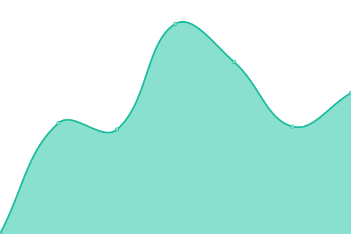
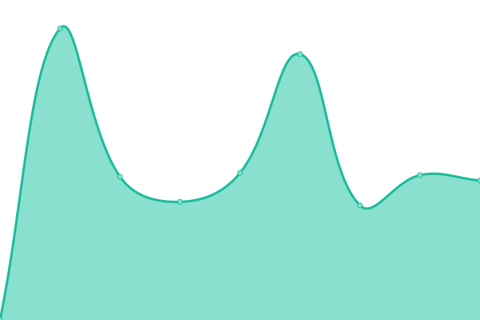
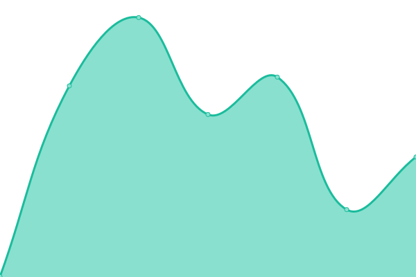

# 📈 Status: <!--live status--> **🟧 Partial outage**

Monitoramento em **tempo real** dos sites mantidos por Tomazzoni • Hospedagem de site e emails. Pode ser visto em [status.tomazzoni.net](https://status.tomazzoni.net)

<!--start: status pages-->
<!-- This summary is generated by Upptime (https://github.com/upptime/upptime) -->
<!-- Do not edit this manually, your changes will be overwritten -->
<!-- prettier-ignore -->
| URL | Status | History | Response Time | Uptime |
| --- | ------ | ------- | ------------- | ------ |
|  [2coelhos.com.br](https://2coelhos.com.br) | Inativo | [2coelhos-com-br.yml](https://github.com/tomattone/status/commits/HEAD/history/2coelhos-com-br.yml) | 

 2802ms
     
 | 

<a href="https://status.tomazzoni.net/history/2coelhos-com-br">94.62%</a>
    

|  [a1sistemas.com.br](https://a1sistemas.com.br) | Inativo | [a1sistemas-com-br.yml](https://github.com/tomattone/status/commits/HEAD/history/a1sistemas-com-br.yml) | 

 1558ms
     
 | 

<a href="https://status.tomazzoni.net/history/a1sistemas-com-br">95.35%</a>
    

|  [absolutacertificados.com.br](https://absolutacertificados.com.br) | Ativo | [absolutacertificados-com-br.yml](https://github.com/tomattone/status/commits/HEAD/history/absolutacertificados-com-br.yml) | 

 402ms
     
 | 

<a href="https://status.tomazzoni.net/history/absolutacertificados-com-br">100.00%</a>
    

|  [aguadeanjo.com.br](https://aguadeanjo.com.br) | Inativo | [aguadeanjo-com-br.yml](https://github.com/tomattone/status/commits/HEAD/history/aguadeanjo-com-br.yml) | 

 1899ms
     
 | 

<a href="https://status.tomazzoni.net/history/aguadeanjo-com-br">95.38%</a>
    

|  [agilpressseguros.com.br](https://agilpressseguros.com.br) | Ativo | [agilpressseguros-com-br.yml](https://github.com/tomattone/status/commits/HEAD/history/agilpressseguros-com-br.yml) | 

 395ms
     
 | 

<a href="https://status.tomazzoni.net/history/agilpressseguros-com-br">99.20%</a>
    

|  [agpmarcasepatentes.com.br](https://agpmarcasepatentes.com.br) | Ativo | [agpmarcasepatentes-com-br.yml](https://github.com/tomattone/status/commits/HEAD/history/agpmarcasepatentes-com-br.yml) | 

 1708ms
     
 | 

<a href="https://status.tomazzoni.net/history/agpmarcasepatentes-com-br">100.00%</a>
    

|  [agrobiologica.com.br](https://agrobiologica.com.br) | Ativo | [agrobiologica-com-br.yml](https://github.com/tomattone/status/commits/HEAD/history/agrobiologica-com-br.yml) | 

 1287ms
     
 | 

<a href="https://status.tomazzoni.net/history/agrobiologica-com-br">100.00%</a>
    

|  [aguiasistemas.com.br](https://aguiasistemas.com.br) | Ativo | [aguiasistemas-com-br.yml](https://github.com/tomattone/status/commits/HEAD/history/aguiasistemas-com-br.yml) | 

 473ms
     
 | 

<a href="https://status.tomazzoni.net/history/aguiasistemas-com-br">99.69%</a>
    

|  [aldeia.work](https://aldeia.work) | Ativo | [aldeia-work.yml](https://github.com/tomattone/status/commits/HEAD/history/aldeia-work.yml) | 

 518ms
     
 | 

<a href="https://status.tomazzoni.net/history/aldeia-work">100.00%</a>
    

|  [alluv.com.br](https://alluv.com.br) | Inativo | [alluv-com-br.yml](https://github.com/tomattone/status/commits/HEAD/history/alluv-com-br.yml) | 

 6345ms
     
 | 

<a href="https://status.tomazzoni.net/history/alluv-com-br">95.45%</a>
    

|  [analise.eng.br](https://analise.eng.br) | Ativo | [analise-eng-br.yml](https://github.com/tomattone/status/commits/HEAD/history/analise-eng-br.yml) | 

 224ms
     
 | 

<a href="https://status.tomazzoni.net/history/analise-eng-br">100.00%</a>
    

|  [andressavieira.com.br](https://andressavieira.com.br) | Ativo | [andressavieira-com-br.yml](https://github.com/tomattone/status/commits/HEAD/history/andressavieira-com-br.yml) | 

 977ms
     
 | 

<a href="https://status.tomazzoni.net/history/andressavieira-com-br">100.00%</a>
    

|  [atendimento.vitallelaboratorio.com.br](https://atendimento.vitallelaboratorio.com.br) | Ativo | [atendimento-vitallelaboratorio-com-br.yml](https://github.com/tomattone/status/commits/HEAD/history/atendimento-vitallelaboratorio-com-br.yml) | 

 611ms
     
 | 

<a href="https://status.tomazzoni.net/history/atendimento-vitallelaboratorio-com-br">100.00%</a>
    

|  [avanttengenharia.com.br](https://avanttengenharia.com.br) | Inativo | [avanttengenharia-com-br.yml](https://github.com/tomattone/status/commits/HEAD/history/avanttengenharia-com-br.yml) | 

 644ms
     
 | 

<a href="https://status.tomazzoni.net/history/avanttengenharia-com-br">95.63%</a>
    

|  [basesolida.com.br](https://basesolida.com.br) | Ativo | [basesolida-com-br.yml](https://github.com/tomattone/status/commits/HEAD/history/basesolida-com-br.yml) | 

 2028ms
     
 | 

<a href="https://status.tomazzoni.net/history/basesolida-com-br">100.00%</a>
    

|  [brickto.com](https://brickto.com) | Ativo | [brickto-com.yml](https://github.com/tomattone/status/commits/HEAD/history/brickto-com.yml) | 

 1891ms
     
 | 

<a href="https://status.tomazzoni.net/history/brickto-com">100.00%</a>
    

|  [brigatapizzaria.com.br](https://brigatapizzaria.com.br) | Ativo | [brigatapizzaria-com-br.yml](https://github.com/tomattone/status/commits/HEAD/history/brigatapizzaria-com-br.yml) | 

 394ms
     
 | 

<a href="https://status.tomazzoni.net/history/brigatapizzaria-com-br">100.00%</a>
    

|  [cachoeiradamariquinha.com.br](https://cachoeiradamariquinha.com.br) | Ativo | [cachoeiradamariquinha-com-br.yml](https://github.com/tomattone/status/commits/HEAD/history/cachoeiradamariquinha-com-br.yml) | 

 1691ms
     
 | 

<a href="https://status.tomazzoni.net/history/cachoeiradamariquinha-com-br">100.00%</a>
    

|  [calponta.com.br](https://calponta.com.br) | Ativo | [calponta-com-br.yml](https://github.com/tomattone/status/commits/HEAD/history/calponta-com-br.yml) | 

 793ms
     
 | 

<a href="https://status.tomazzoni.net/history/calponta-com-br">100.00%</a>
    

|  [capitalli.one](https://capitalli.one) | Ativo | [capitalli-one.yml](https://github.com/tomattone/status/commits/HEAD/history/capitalli-one.yml) | 

 567ms
     
 | 

<a href="https://status.tomazzoni.net/history/capitalli-one">100.00%</a>
    

|  [centralpremy.com.br](https://centralpremy.com.br) | Ativo | [centralpremy-com-br.yml](https://github.com/tomattone/status/commits/HEAD/history/centralpremy-com-br.yml) | 

 285ms
     
 | 

<a href="https://status.tomazzoni.net/history/centralpremy-com-br">100.00%</a>
    

|  [cdepg.org.br](https://cdepg.org.br) | Ativo | [cdepg-org-br.yml](https://github.com/tomattone/status/commits/HEAD/history/cdepg-org-br.yml) | 

 867ms
     
 | 

<a href="https://status.tomazzoni.net/history/cdepg-org-br">100.00%</a>
    

|  [coopesp.com.br](https://coopesp.com.br) | Ativo | [coopesp-com-br.yml](https://github.com/tomattone/status/commits/HEAD/history/coopesp-com-br.yml) | 

 998ms
     
 | 

<a href="https://status.tomazzoni.net/history/coopesp-com-br">100.00%</a>
    

|  [compensadosscharan.com.br](https://compensadosscharan.com.br) | Ativo | [compensadosscharan-com-br.yml](https://github.com/tomattone/status/commits/HEAD/history/compensadosscharan-com-br.yml) | 

 424ms
     
 | 

<a href="https://status.tomazzoni.net/history/compensadosscharan-com-br">100.00%</a>
    

|  [compensadosgranada.com.br](https://compensadosgranada.com.br) | Ativo | [compensadosgranada-com-br.yml](https://github.com/tomattone/status/commits/HEAD/history/compensadosgranada-com-br.yml) | 

 1899ms
     
 | 

<a href="https://status.tomazzoni.net/history/compensadosgranada-com-br">100.00%</a>
    

|  [conceitoimoveisbc.com.br](https://conceitoimoveisbc.com.br) | Ativo | [conceitoimoveisbc-com-br.yml](https://github.com/tomattone/status/commits/HEAD/history/conceitoimoveisbc-com-br.yml) | 

 466ms
     
 | 

<a href="https://status.tomazzoni.net/history/conceitoimoveisbc-com-br">100.00%</a>
    

|  [conceitoimoveispg.com.br](https://conceitoimoveispg.com.br) | Ativo | [conceitoimoveispg-com-br.yml](https://github.com/tomattone/status/commits/HEAD/history/conceitoimoveispg-com-br.yml) | 

 630ms
     
 | 

<a href="https://status.tomazzoni.net/history/conceitoimoveispg-com-br">100.00%</a>
    

|  [conceitoimoveissc.com.br](https://conceitoimoveissc.com.br) | Ativo | [conceitoimoveissc-com-br.yml](https://github.com/tomattone/status/commits/HEAD/history/conceitoimoveissc-com-br.yml) | 

 833ms
     
 | 

<a href="https://status.tomazzoni.net/history/conceitoimoveissc-com-br">100.00%</a>
    

|  [construtorabaseforte.com.br](https://construtorabaseforte.com.br) | Ativo | [construtorabaseforte-com-br.yml](https://github.com/tomattone/status/commits/HEAD/history/construtorabaseforte-com-br.yml) | 

 233ms
     
 | 

<a href="https://status.tomazzoni.net/history/construtorabaseforte-com-br">100.00%</a>
    

|  [construtorajmc.com.br](https://construtorajmc.com.br) | Ativo | [construtorajmc-com-br.yml](https://github.com/tomattone/status/commits/HEAD/history/construtorajmc-com-br.yml) | 

 397ms
     
 | 

<a href="https://status.tomazzoni.net/history/construtorajmc-com-br">100.00%</a>
    

|  [construtoralegacy.com.br](https://construtoralegacy.com.br) | Inativo | [construtoralegacy-com-br.yml](https://github.com/tomattone/status/commits/HEAD/history/construtoralegacy-com-br.yml) | 

 743ms
     
 | 

<a href="https://status.tomazzoni.net/history/construtoralegacy-com-br">95.66%</a>
    

|  [construtoralcs.com.br](https://construtoralcs.com.br) | Ativo | [construtoralcs-com-br.yml](https://github.com/tomattone/status/commits/HEAD/history/construtoralcs-com-br.yml) | 

 871ms
     
 | 

<a href="https://status.tomazzoni.net/history/construtoralcs-com-br">100.00%</a>
    

|  [contornoturbo.com.br](https://contornoturbo.com.br) | Inativo | [contornoturbo-com-br.yml](https://github.com/tomattone/status/commits/HEAD/history/contornoturbo-com-br.yml) | 

 603ms
     
 | 

<a href="https://status.tomazzoni.net/history/contornoturbo-com-br">95.69%</a>
    

|  [culturasulfm.com.br](https://culturasulfm.com.br) | Ativo | [culturasulfm-com-br.yml](https://github.com/tomattone/status/commits/HEAD/history/culturasulfm-com-br.yml) | 

 3715ms
     
 | 

<a href="https://status.tomazzoni.net/history/culturasulfm-com-br">100.00%</a>
    

|  [delpozotransportes.com.br](https://delpozotransportes.com.br) | Ativo | [delpozotransportes-com-br.yml](https://github.com/tomattone/status/commits/HEAD/history/delpozotransportes-com-br.yml) | 

 1460ms
     
 | 

<a href="https://status.tomazzoni.net/history/delpozotransportes-com-br">100.00%</a>
    

|  [dev.stelladiamonds.com.br](https://dev.stelladiamonds.com.br) | Inativo | [dev-stelladiamonds-com-br.yml](https://github.com/tomattone/status/commits/HEAD/history/dev-stelladiamonds-com-br.yml) | 

 167ms
     
 | 

<a href="https://status.tomazzoni.net/history/dev-stelladiamonds-com-br">0.00%</a>
    

|  [dnaframing.com.br](https://dnaframing.com.br) | Inativo | [dnaframing-com-br.yml](https://github.com/tomattone/status/commits/HEAD/history/dnaframing-com-br.yml) | 

 1914ms
     
 | 

<a href="https://status.tomazzoni.net/history/dnaframing-com-br">95.74%</a>
    

|  [draanelise.com.br](https://draanelise.com.br) | Ativo | [draanelise-com-br.yml](https://github.com/tomattone/status/commits/HEAD/history/draanelise-com-br.yml) | 

 429ms
     
 | 

<a href="https://status.tomazzoni.net/history/draanelise-com-br">100.00%</a>
    

|  [edmararaujo.com.br](https://edmararaujo.com.br) | Ativo | [edmararaujo-com-br.yml](https://github.com/tomattone/status/commits/HEAD/history/edmararaujo-com-br.yml) | 

 928ms
     
 | 

<a href="https://status.tomazzoni.net/history/edmararaujo-com-br">100.00%</a>
    

|  [ecbeng.com.br](https://ecbeng.com.br) | Ativo | [ecbeng-com-br.yml](https://github.com/tomattone/status/commits/HEAD/history/ecbeng-com-br.yml) | 

 1130ms
     
 | 

<a href="https://status.tomazzoni.net/history/ecbeng-com-br">100.00%</a>
    

|  [estofadosabara.com.br](https://estofadosabara.com.br) | Inativo | [estofadosabara-com-br.yml](https://github.com/tomattone/status/commits/HEAD/history/estofadosabara-com-br.yml) | 

 4609ms
     
 | 

<a href="https://status.tomazzoni.net/history/estofadosabara-com-br">95.87%</a>
    

|  [estudiohugofreire.com](https://estudiohugofreire.com) | Ativo | [estudiohugofreire-com.yml](https://github.com/tomattone/status/commits/HEAD/history/estudiohugofreire-com.yml) | 

 524ms
     
 | 

<a href="https://status.tomazzoni.net/history/estudiohugofreire-com">100.00%</a>
    

|  [feijaopontarollo.com.br](https://feijaopontarollo.com.br) | Inativo | [feijaopontarollo-com-br.yml](https://github.com/tomattone/status/commits/HEAD/history/feijaopontarollo-com-br.yml) | 

 1975ms
     
 | 

<a href="https://status.tomazzoni.net/history/feijaopontarollo-com-br">96.09%</a>
    

|  [fluidponta.com.br](https://fluidponta.com.br) | Inativo | [fluidponta-com-br.yml](https://github.com/tomattone/status/commits/HEAD/history/fluidponta-com-br.yml) | 

 589ms
     
 | 

<a href="https://status.tomazzoni.net/history/fluidponta-com-br">96.05%</a>
    

|  [fraciona.com.br](https://fraciona.com.br) | Inativo | [fraciona-com-br.yml](https://github.com/tomattone/status/commits/HEAD/history/fraciona-com-br.yml) | 

 1540ms
     
 | 

<a href="https://status.tomazzoni.net/history/fraciona-com-br">96.06%</a>
    

|  [funerariasantanapg.com.br](https://funerariasantanapg.com.br) | Inativo | [funerariasantanapg-com-br.yml](https://github.com/tomattone/status/commits/HEAD/history/funerariasantanapg-com-br.yml) | 

 2406ms
     
 | 

<a href="https://status.tomazzoni.net/history/funerariasantanapg-com-br">96.08%</a>
    

|  [gabrielambrozio.com](https://gabrielambrozio.com) | Inativo | [gabrielambrozio-com.yml](https://github.com/tomattone/status/commits/HEAD/history/gabrielambrozio-com.yml) | 

 1096ms
     
 | 

<a href="https://status.tomazzoni.net/history/gabrielambrozio-com">96.11%</a>
    

|  [gravinaonline.com.br](https://gravinaonline.com.br) | Ativo | [gravinaonline-com-br.yml](https://github.com/tomattone/status/commits/HEAD/history/gravinaonline-com-br.yml) | 

 629ms
     
 | 

<a href="https://status.tomazzoni.net/history/gravinaonline-com-br">100.00%</a>
    

|  [grupomezzo.com](https://grupomezzo.com) | Inativo | [grupomezzo-com.yml](https://github.com/tomattone/status/commits/HEAD/history/grupomezzo-com.yml) | 

 98ms
     
 | 

<a href="https://status.tomazzoni.net/history/grupomezzo-com">100.00%</a>
    

|  [ibras.com.br](https://ibras.com.br) | Ativo | [ibras-com-br.yml](https://github.com/tomattone/status/commits/HEAD/history/ibras-com-br.yml) | 

 528ms
     
 | 

<a href="https://status.tomazzoni.net/history/ibras-com-br">100.00%</a>
    

|  [kaosestudio.com.br](https://kaosestudio.com.br) | Inativo | [kaosestudio-com-br.yml](https://github.com/tomattone/status/commits/HEAD/history/kaosestudio-com-br.yml) | 

 568ms
     
 | 

<a href="https://status.tomazzoni.net/history/kaosestudio-com-br">96.13%</a>
    

|  [krugerflorestal.com.br](https://krugerflorestal.com.br) | Inativo | [krugerflorestal-com-br.yml](https://github.com/tomattone/status/commits/HEAD/history/krugerflorestal-com-br.yml) | 

 2172ms
     
 | 

<a href="https://status.tomazzoni.net/history/krugerflorestal-com-br">96.15%</a>
    

|  [lagoinovacoes.com.br](http://lagoinovacoes.com.br) | Inativo | [lagoinovacoes-com-br.yml](https://github.com/tomattone/status/commits/HEAD/history/lagoinovacoes-com-br.yml) | 

 424ms
     
 | 

<a href="https://status.tomazzoni.net/history/lagoinovacoes-com-br">96.17%</a>
    

|  [lepiegemotel.com.br](https://lepiegemotel.com.br) | Ativo | [lepiegemotel-com-br.yml](https://github.com/tomattone/status/commits/HEAD/history/lepiegemotel-com-br.yml) | 

 2580ms
     
 | 

<a href="https://status.tomazzoni.net/history/lepiegemotel-com-br">100.00%</a>
    

|  [lionsdev.com.br](https://lionsdev.com.br) | Ativo | [lionsdev-com-br.yml](https://github.com/tomattone/status/commits/HEAD/history/lionsdev-com-br.yml) | 

 2333ms
     
 | 

<a href="https://status.tomazzoni.net/history/lionsdev-com-br">100.00%</a>
    

|  [lojaodokeima.com.br](https://lojaodokeima.com.br) | Ativo | [lojaodokeima-com-br.yml](https://github.com/tomattone/status/commits/HEAD/history/lojaodokeima-com-br.yml) | 

 823ms
     
 | 

<a href="https://status.tomazzoni.net/history/lojaodokeima-com-br">99.66%</a>
    

|  [lojasulfashion.com.br](https://lojasulfashion.com.br) | Ativo | [lojasulfashion-com-br.yml](https://github.com/tomattone/status/commits/HEAD/history/lojasulfashion-com-br.yml) | 

 1494ms
     
 | 

<a href="https://status.tomazzoni.net/history/lojasulfashion-com-br">3.12%</a>
    

|  [lordtower.com.br](https://lordtower.com.br) | Ativo | [lordtower-com-br.yml](https://github.com/tomattone/status/commits/HEAD/history/lordtower-com-br.yml) | 

 615ms
     
 | 

<a href="https://status.tomazzoni.net/history/lordtower-com-br">0.00%</a>
    

|  [macpontacaminhoes.com.br](https://macpontacaminhoes.com.br) | Ativo | [macpontacaminhoes-com-br.yml](https://github.com/tomattone/status/commits/HEAD/history/macpontacaminhoes-com-br.yml) | 

 1111ms
     
 | 

<a href="https://status.tomazzoni.net/history/macpontacaminhoes-com-br">100.00%</a>
    

|  [medicoapp.com.br](https://medicoapp.com.br) | Inativo | [medicoapp-com-br.yml](https://github.com/tomattone/status/commits/HEAD/history/medicoapp-com-br.yml) | 

 0ms
     
 | 

<a href="https://status.tomazzoni.net/history/medicoapp-com-br">100.00%</a>
    

|  [melkland.com.br](https://melkland.com.br) | Ativo | [melkland-com-br.yml](https://github.com/tomattone/status/commits/HEAD/history/melkland-com-br.yml) | 

 379ms
     
 | 

<a href="https://status.tomazzoni.net/history/melkland-com-br">100.00%</a>
    

|  [mercadodeeventos.com](https://www.mercadodeeventos.com) | Inativo | [mercadodeeventos-com.yml](https://github.com/tomattone/status/commits/HEAD/history/mercadodeeventos-com.yml) | 

 489ms
     
 | 

<a href="https://status.tomazzoni.net/history/mercadodeeventos-com">96.21%</a>
    

|  [miarakruger.com.br](https://miarakruger.com.br) | Ativo | [miarakruger-com-br.yml](https://github.com/tomattone/status/commits/HEAD/history/miarakruger-com-br.yml) | 

 700ms
     
 | 

<a href="https://status.tomazzoni.net/history/miarakruger-com-br">100.00%</a>
    

|  [miquelao.com.br](https://miquelao.com.br) | Ativo | [miquelao-com-br.yml](https://github.com/tomattone/status/commits/HEAD/history/miquelao-com-br.yml) | 

 185ms
     
 | 

<a href="https://status.tomazzoni.net/history/miquelao-com-br">100.00%</a>
    

|  [mmmilleo.com.br](https://mmmilleo.com.br) | Ativo | [mmmilleo-com-br.yml](https://github.com/tomattone/status/commits/HEAD/history/mmmilleo-com-br.yml) | 

 389ms
     
 | 

<a href="https://status.tomazzoni.net/history/mmmilleo-com-br">100.00%</a>
    

|  [mudardeimovel.com.br](https://mudardeimovel.com.br) | Ativo | [mudardeimovel-com-br.yml](https://github.com/tomattone/status/commits/HEAD/history/mudardeimovel-com-br.yml) | 

 582ms
     
 | 

<a href="https://status.tomazzoni.net/history/mudardeimovel-com-br">100.00%</a>
    

|  [na4.com.br](https://na4.com.br) | Inativo | [na4-com-br.yml](https://github.com/tomattone/status/commits/HEAD/history/na4-com-br.yml) | 

 719ms
     
 | 

<a href="https://status.tomazzoni.net/history/na4-com-br">96.37%</a>
    

|  [nascarautovidros.com.br](https://nascarautovidros.com.br) | Ativo | [nascarautovidros-com-br.yml](https://github.com/tomattone/status/commits/HEAD/history/nascarautovidros-com-br.yml) | 

 354ms
     
 | 

<a href="https://status.tomazzoni.net/history/nascarautovidros-com-br">100.00%</a>
    

|  [odontofares.com.br](https://odontofares.com.br) | Ativo | [odontofares-com-br.yml](https://github.com/tomattone/status/commits/HEAD/history/odontofares-com-br.yml) | 

 407ms
     
 | 

<a href="https://status.tomazzoni.net/history/odontofares-com-br">100.00%</a>
    

|  [omxsistemas.com.br](https://omxsistemas.com.br) | Ativo | [omxsistemas-com-br.yml](https://github.com/tomattone/status/commits/HEAD/history/omxsistemas-com-br.yml) | 

 1373ms
     
 | 

<a href="https://status.tomazzoni.net/history/omxsistemas-com-br">100.00%</a>
    

|  [opiummotel.com](https://opiummotel.com) | Ativo | [opiummotel-com.yml](https://github.com/tomattone/status/commits/HEAD/history/opiummotel-com.yml) | 

 608ms
     
 | 

<a href="https://status.tomazzoni.net/history/opiummotel-com">99.35%</a>
    

|  [orquestraapreciatto.com.br](https://orquestraapreciatto.com.br) | Inativo | [orquestraapreciatto-com-br.yml](https://github.com/tomattone/status/commits/HEAD/history/orquestraapreciatto-com-br.yml) | 

 1620ms
     
 | 

<a href="https://status.tomazzoni.net/history/orquestraapreciatto-com-br">96.49%</a>
    

|  [personapublicidade.com.br](https://personapublicidade.com.br) | Ativo | [personapublicidade-com-br.yml](https://github.com/tomattone/status/commits/HEAD/history/personapublicidade-com-br.yml) | 

 1325ms
     
 | 

<a href="https://status.tomazzoni.net/history/personapublicidade-com-br">100.00%</a>
    

|  [plenacertificados.com.br](https://plenacertificados.com.br) | Inativo | [plenacertificados-com-br.yml](https://github.com/tomattone/status/commits/HEAD/history/plenacertificados-com-br.yml) | 

 2276ms
     
 | 

<a href="https://status.tomazzoni.net/history/plenacertificados-com-br">96.51%</a>
    

|  [polomadeireiro.com.br](https://polomadeireiro.com.br) | Inativo | [polomadeireiro-com-br.yml](https://github.com/tomattone/status/commits/HEAD/history/polomadeireiro-com-br.yml) | 

 1725ms
     
 | 

<a href="https://status.tomazzoni.net/history/polomadeireiro-com-br">96.53%</a>
    

|  [pontaengenharia.com.br](https://pontaengenharia.com.br) | Ativo | [pontaengenharia-com-br.yml](https://github.com/tomattone/status/commits/HEAD/history/pontaengenharia-com-br.yml) | 

 232ms
     
 | 

<a href="https://status.tomazzoni.net/history/pontaengenharia-com-br">100.00%</a>
    

|  [pramio.com.br](https://pramio.com.br) | Inativo | [pramio-com-br.yml](https://github.com/tomattone/status/commits/HEAD/history/pramio-com-br.yml) | 

 171ms
     
 | 

<a href="https://status.tomazzoni.net/history/pramio-com-br">100.00%</a>
    

|  [prmempreendimentos.com.br](https://prmempreendimentos.com.br) | Ativo | [prmempreendimentos-com-br.yml](https://github.com/tomattone/status/commits/HEAD/history/prmempreendimentos-com-br.yml) | 

 415ms
     
 | 

<a href="https://status.tomazzoni.net/history/prmempreendimentos-com-br">100.00%</a>
    

|  [preambulo.com.br](https://preambulo.com.br) | Ativo | [preambulo-com-br.yml](https://github.com/tomattone/status/commits/HEAD/history/preambulo-com-br.yml) | 

 242ms
     
 | 

<a href="https://status.tomazzoni.net/history/preambulo-com-br">100.00%</a>
    

|  [prazeresdobanhoabc.com.br](https://prazeresdobanhoabc.com.br) | Ativo | [prazeresdobanhoabc-com-br.yml](https://github.com/tomattone/status/commits/HEAD/history/prazeresdobanhoabc-com-br.yml) | 

 20518ms
     
 | 

<a href="https://status.tomazzoni.net/history/prazeresdobanhoabc-com-br">81.52%</a>
    

|  [rbsodontologia.com.br](https://rbsodontologia.com.br) | Ativo | [rbsodontologia-com-br.yml](https://github.com/tomattone/status/commits/HEAD/history/rbsodontologia-com-br.yml) | 

 367ms
     
 | 

<a href="https://status.tomazzoni.net/history/rbsodontologia-com-br">100.00%</a>
    

|  [retibom.com](https://retibom.com) | Inativo | [retibom-com.yml](https://github.com/tomattone/status/commits/HEAD/history/retibom-com.yml) | 

 3755ms
     
 | 

<a href="https://status.tomazzoni.net/history/retibom-com">96.99%</a>
    

|  [rhodmann.com.br](https://rhodmann.com.br) | Inativo | [rhodmann-com-br.yml](https://github.com/tomattone/status/commits/HEAD/history/rhodmann-com-br.yml) | 

 3859ms
     
 | 

<a href="https://status.tomazzoni.net/history/rhodmann-com-br">89.00%</a>
    

|  [riobrancolab.com.br](https://riobrancolab.com.br) | Inativo | [riobrancolab-com-br.yml](https://github.com/tomattone/status/commits/HEAD/history/riobrancolab-com-br.yml) | 

 1197ms
     
 | 

    

|  [rodrigoscheidt.com](https://rodrigoscheidt.com) | Ativo | [rodrigoscheidt-com.yml](https://github.com/tomattone/status/commits/HEAD/history/rodrigoscheidt-com.yml) | 

 867ms
     
 | 

<a href="https://status.tomazzoni.net/history/rodrigoscheidt-com">0.00%</a>
    

|  [romanceshistoricos.com.br](https://romanceshistoricos.com.br) | Inativo | [romanceshistoricos-com-br.yml](https://github.com/tomattone/status/commits/HEAD/history/romanceshistoricos-com-br.yml) | 

 2163ms
     
 | 

<a href="https://status.tomazzoni.net/history/romanceshistoricos-com-br">96.98%</a>
    

|  [servtintas.com.br](https://servtintas.com.br) | Inativo | [servtintas-com-br.yml](https://github.com/tomattone/status/commits/HEAD/history/servtintas-com-br.yml) | 

 865ms
     
 | 

<a href="https://status.tomazzoni.net/history/servtintas-com-br">96.99%</a>
    

|  [shoppingcarpg.com.br](https://shoppingcarpg.com.br) | Ativo | [shoppingcarpg-com-br.yml](https://github.com/tomattone/status/commits/HEAD/history/shoppingcarpg-com-br.yml) | 

 382ms
     
 | 

<a href="https://status.tomazzoni.net/history/shoppingcarpg-com-br">100.00%</a>
    

|  [solarini.com.br](https://solarini.com.br) | Inativo | [solarini-com-br.yml](https://github.com/tomattone/status/commits/HEAD/history/solarini-com-br.yml) | 

 2557ms
     
 | 

<a href="https://status.tomazzoni.net/history/solarini-com-br">97.01%</a>
    

|  [sosalegria.org](https://sosalegria.org) | Inativo | [sosalegria-org.yml](https://github.com/tomattone/status/commits/HEAD/history/sosalegria-org.yml) | 

 2944ms
     
 | 

<a href="https://status.tomazzoni.net/history/sosalegria-org">97.02%</a>
    

|  [stelladiamonds.com.br](https://stelladiamonds.com.br/minha-conta/) | Inativo | [stelladiamonds-com-br.yml](https://github.com/tomattone/status/commits/HEAD/history/stelladiamonds-com-br.yml) | 

 163ms
     
 | 

<a href="https://status.tomazzoni.net/history/stelladiamonds-com-br">100.00%</a>
    

|  [studio32.com.br](https://studio32.com.br) | Ativo | [studio32-com-br.yml](https://github.com/tomattone/status/commits/HEAD/history/studio32-com-br.yml) | 

 1093ms
     
 | 

<a href="https://status.tomazzoni.net/history/studio32-com-br">97.05%</a>
    

|  [tecplastbrasil.com.br](https://tecplastbrasil.com.br) | Ativo | [tecplastbrasil-com-br.yml](https://github.com/tomattone/status/commits/HEAD/history/tecplastbrasil-com-br.yml) | 

 550ms
     
 | 

<a href="https://status.tomazzoni.net/history/tecplastbrasil-com-br">97.06%</a>
    

|  [terraseguros.com.br](https://terraseguros.com.br) | Ativo | [terraseguros-com-br.yml](https://github.com/tomattone/status/commits/HEAD/history/terraseguros-com-br.yml) | 

 199ms
     
 | 

<a href="https://status.tomazzoni.net/history/terraseguros-com-br">100.00%</a>
    

|  [tomazzoni.net](https://tomazzoni.net) | Ativo | [tomazzoni-net.yml](https://github.com/tomattone/status/commits/HEAD/history/tomazzoni-net.yml) | 

 510ms
     
 | 

<a href="https://status.tomazzoni.net/history/tomazzoni-net">100.00%</a>
    

|  [torrie.com.br](https://torrie.com.br) | Ativo | [torrie-com-br.yml](https://github.com/tomattone/status/commits/HEAD/history/torrie-com-br.yml) | 

 1174ms
     
 | 

<a href="https://status.tomazzoni.net/history/torrie-com-br">97.07%</a>
    

|  [traxt.io](https://traxt.io) | Ativo | [traxt-io.yml](https://github.com/tomattone/status/commits/HEAD/history/traxt-io.yml) | 

 324ms
     
 | 

<a href="https://status.tomazzoni.net/history/traxt-io">100.00%</a>
    

|  [trcdistribuicao.com.br](https://trcdistribuicao.com.br) | Inativo | [trcdistribuicao-com-br.yml](https://github.com/tomattone/status/commits/HEAD/history/trcdistribuicao-com-br.yml) | 

 173ms
     
 | 

<a href="https://status.tomazzoni.net/history/trcdistribuicao-com-br">0.00%</a>
    

|  [vfteng.com.br](https://vfteng.com.br) | Inativo | [vfteng-com-br.yml](https://github.com/tomattone/status/commits/HEAD/history/vfteng-com-br.yml) | 

 1093ms
     
 | 

<a href="https://status.tomazzoni.net/history/vfteng-com-br">74.18%</a>
    

|  [vilanovamazon.com.br](https://vilanovamazon.com.br) | Ativo | [vilanovamazon-com-br.yml](https://github.com/tomattone/status/commits/HEAD/history/vilanovamazon-com-br.yml) | 

 545ms
     
 | 

<a href="https://status.tomazzoni.net/history/vilanovamazon-com-br">97.09%</a>
    

|  [vilavilo.com.br](https://vilavilo.com.br) | Ativo | [vilavilo-com-br.yml](https://github.com/tomattone/status/commits/HEAD/history/vilavilo-com-br.yml) | 

 903ms
     
 | 

<a href="https://status.tomazzoni.net/history/vilavilo-com-br">100.00%</a>
    

|  [villagioverdeeventos.com.br](https://villagioverdeeventos.com.br) | Ativo | [villagioverdeeventos-com-br.yml](https://github.com/tomattone/status/commits/HEAD/history/villagioverdeeventos-com-br.yml) | 

 1388ms
     
 | 

<a href="https://status.tomazzoni.net/history/villagioverdeeventos-com-br">100.00%</a>
    

|  [villenamoveis.com.br](https://villenamoveis.com.br) | Ativo | [villenamoveis-com-br.yml](https://github.com/tomattone/status/commits/HEAD/history/villenamoveis-com-br.yml) | 

 1315ms
     
 | 

<a href="https://status.tomazzoni.net/history/villenamoveis-com-br">97.10%</a>
    

|  [visonmotel.com](https://visonmotel.com) | Ativo | [visonmotel-com.yml](https://github.com/tomattone/status/commits/HEAD/history/visonmotel-com.yml) | 

 2828ms
     
 | 

<a href="https://status.tomazzoni.net/history/visonmotel-com">100.00%</a>
    

<!--end: status pages-->

[**Visitar site →**](https://status.tomazzoni.net)
