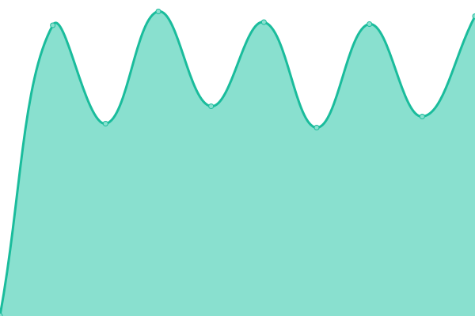
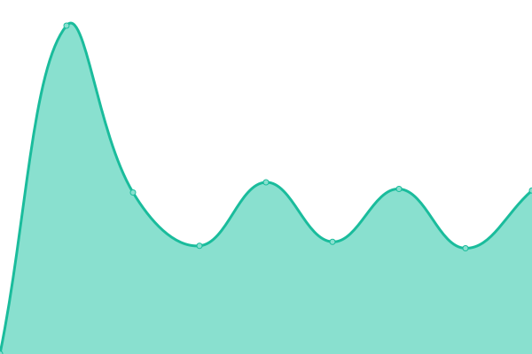
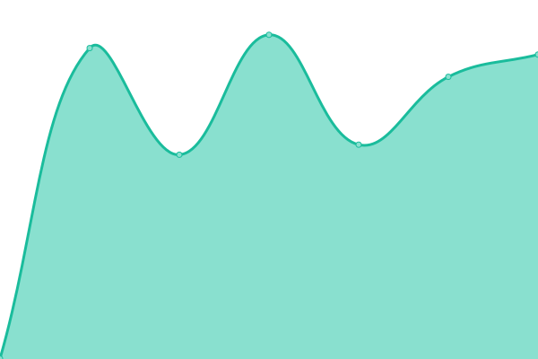

# [📈 Live Status](https://status.tomazzoni.net): <!--live status--> **🟧 Partial outage**

This repository contains the open-source uptime monitor and status page for [Armando Tomazzoni Jr](https://status.tomazzoni.net), powered by [Upptime](https://github.com/upptime/upptime).

With [Upptime](https://upptime.js.org), you can get your own unlimited and free uptime monitor and status page, powered entirely by a GitHub repository. We use [Issues](https://github.com/tomattone/status/issues) as incident reports, [Actions](https://github.com/tomattone/status/actions) as uptime monitors, and [Pages](https://status.tomazzoni.net) for the status page.

<!--start: status pages-->
<!-- This summary is generated by Upptime (https://github.com/upptime/upptime) -->
<!-- Do not edit this manually, your changes will be overwritten -->
<!-- prettier-ignore -->
| URL | Status | History | Response Time | Uptime |
| --- | ------ | ------- | ------------- | ------ |
|  [construtoralcs.com.br](https://construtoralcs.com.br) | 🟩 Up | [construtoralcs-com-br.yml](https://github.com/tomattone/status/commits/HEAD/history/construtoralcs-com-br.yml) | 

 20972ms
     
 | 

<a href="https://status.tomazzoni.net/history/construtoralcs-com-br">100.00%</a>
    

|  [construtoralcs.com.br](https://construtoralcs.com.br) | 🟩 Up | [construtoralcs-com-br.yml](https://github.com/tomattone/status/commits/HEAD/history/construtoralcs-com-br.yml) | 

 20972ms
     
 | 

<a href="https://status.tomazzoni.net/history/construtoralcs-com-br">100.00%</a>
    

|  [mudardeimovel.com.br](https://mudardeimovel.com.br) | 🟩 Up | [mudardeimovel-com-br.yml](https://github.com/tomattone/status/commits/HEAD/history/mudardeimovel-com-br.yml) | 

 594ms
     
 | 

<a href="https://status.tomazzoni.net/history/mudardeimovel-com-br">100.00%</a>
    

|  [lafontebr.com](https://lafontebr.com) | 🟩 Up | [lafontebr-com.yml](https://github.com/tomattone/status/commits/HEAD/history/lafontebr-com.yml) | 

 229ms
     
 | 

<a href="https://status.tomazzoni.net/history/lafontebr-com">100.00%</a>
    

|  [basesolida.com.br](https://basesolida.com.br) | 🟩 Up | [basesolida-com-br.yml](https://github.com/tomattone/status/commits/HEAD/history/basesolida-com-br.yml) | 

 1737ms
     
 | 

<a href="https://status.tomazzoni.net/history/basesolida-com-br">100.00%</a>
    

|  [dallsantoconstrutora.com.br](https://dallsantoconstrutora.com.br) | 🟥 Down | [dallsantoconstrutora-com-br.yml](https://github.com/tomattone/status/commits/HEAD/history/dallsantoconstrutora-com-br.yml) | 

 0ms
     
 | 

<a href="https://status.tomazzoni.net/history/dallsantoconstrutora-com-br">0.00%</a>
    

|  [dominiovisual.com.br](https://dominiovisual.com.br) | 🟩 Up | [dominiovisual-com-br.yml](https://github.com/tomattone/status/commits/HEAD/history/dominiovisual-com-br.yml) | 

 1135ms
     
 | 

<a href="https://status.tomazzoni.net/history/dominiovisual-com-br">100.00%</a>
    

|  [polomadeireiro.com.br](https://polomadeireiro.com.br) | 🟩 Up | [polomadeireiro-com-br.yml](https://github.com/tomattone/status/commits/HEAD/history/polomadeireiro-com-br.yml) | 

 1473ms
     
 | 

<a href="https://status.tomazzoni.net/history/polomadeireiro-com-br">100.00%</a>
    

|  [vilanovamazon.com.br](https://vilanovamazon.com.br) | 🟩 Up | [vilanovamazon-com-br.yml](https://github.com/tomattone/status/commits/HEAD/history/vilanovamazon-com-br.yml) | 

 454ms
     
 | 

<a href="https://status.tomazzoni.net/history/vilanovamazon-com-br">100.00%</a>
    

|  [villenamoveis.com.br](https://villenamoveis.com.br) | 🟩 Up | [villenamoveis-com-br.yml](https://github.com/tomattone/status/commits/HEAD/history/villenamoveis-com-br.yml) | 

 1134ms
     
 | 

<a href="https://status.tomazzoni.net/history/villenamoveis-com-br">100.00%</a>
    

|  [plenacertificadora.com.br](https://plenacertificadora.com.br) | 🟥 Down | [plenacertificadora-com-br.yml](https://github.com/tomattone/status/commits/HEAD/history/plenacertificadora-com-br.yml) | 

 0ms
     
 | 

<a href="https://status.tomazzoni.net/history/plenacertificadora-com-br">0.00%</a>
    

|  [a1sistemas.com.br](https://a1sistemas.com.br) | 🟩 Up | [a1sistemas-com-br.yml](https://github.com/tomattone/status/commits/HEAD/history/a1sistemas-com-br.yml) | 

 952ms
     
 | 

<a href="https://status.tomazzoni.net/history/a1sistemas-com-br">100.00%</a>
    

|  [aguadeanjo.com.br](https://aguadeanjo.com.br) | 🟩 Up | [aguadeanjo-com-br.yml](https://github.com/tomattone/status/commits/HEAD/history/aguadeanjo-com-br.yml) | 

 1414ms
     
 | 

<a href="https://status.tomazzoni.net/history/aguadeanjo-com-br">100.00%</a>
    

|  [brigatapizzaria.com.br](https://brigatapizzaria.com.br) | 🟩 Up | [brigatapizzaria-com-br.yml](https://github.com/tomattone/status/commits/HEAD/history/brigatapizzaria-com-br.yml) | 

 378ms
     
 | 

<a href="https://status.tomazzoni.net/history/brigatapizzaria-com-br">100.00%</a>
    

|  [calponta.com.br](https://calponta.com.br) | 🟩 Up | [calponta-com-br.yml](https://github.com/tomattone/status/commits/HEAD/history/calponta-com-br.yml) | 

 620ms
     
 | 

<a href="https://status.tomazzoni.net/history/calponta-com-br">100.00%</a>
    

|  [dnaframing.com.br](https://dnaframing.com.br) | 🟩 Up | [dnaframing-com-br.yml](https://github.com/tomattone/status/commits/HEAD/history/dnaframing-com-br.yml) | 

 1259ms
     
 | 

<a href="https://status.tomazzoni.net/history/dnaframing-com-br">100.00%</a>
    

|  [draanelise.com.br](https://draanelise.com.br) | 🟩 Up | [draanelise-com-br.yml](https://github.com/tomattone/status/commits/HEAD/history/draanelise-com-br.yml) | 

 428ms
     
 | 

<a href="https://status.tomazzoni.net/history/draanelise-com-br">100.00%</a>
    

|  [estofadosabara.com.br](https://estofadosabara.com.br) | 🟩 Up | [estofadosabara-com-br.yml](https://github.com/tomattone/status/commits/HEAD/history/estofadosabara-com-br.yml) | 

 3133ms
     
 | 

<a href="https://status.tomazzoni.net/history/estofadosabara-com-br">100.00%</a>
    

|  [fraciona.com.br](https://fraciona.com.br) | 🟩 Up | [fraciona-com-br.yml](https://github.com/tomattone/status/commits/HEAD/history/fraciona-com-br.yml) | 

 1308ms
     
 | 

<a href="https://status.tomazzoni.net/history/fraciona-com-br">100.00%</a>
    

|  [grupoprocess.com.br](https://grupoprocess.com.br) | 🟩 Up | [grupoprocess-com-br.yml](https://github.com/tomattone/status/commits/HEAD/history/grupoprocess-com-br.yml) | 

 678ms
     
 | 

<a href="https://status.tomazzoni.net/history/grupoprocess-com-br">100.00%</a>
    

|  [jato.eco.br](https://jato.eco.br) | 🟩 Up | [jato-eco-br.yml](https://github.com/tomattone/status/commits/HEAD/history/jato-eco-br.yml) | 

 779ms
     
 | 

<a href="https://status.tomazzoni.net/history/jato-eco-br">100.00%</a>
    

|  [kaosestudio.com.br](https://kaosestudio.com.br) | 🟥 Down | [kaosestudio-com-br.yml](https://github.com/tomattone/status/commits/HEAD/history/kaosestudio-com-br.yml) | 

 0ms
     
 | 

<a href="https://status.tomazzoni.net/history/kaosestudio-com-br">0.00%</a>
    

|  [marinazanettiarq.com.br](https://marinazanettiarq.com.br) | 🟩 Up | [marinazanettiarq-com-br.yml](https://github.com/tomattone/status/commits/HEAD/history/marinazanettiarq-com-br.yml) | 

 359ms
     
 | 

<a href="https://status.tomazzoni.net/history/marinazanettiarq-com-br">100.00%</a>
    

|  [maybmaia.com.br](https://maybmaia.com.br) | 🟩 Up | [maybmaia-com-br.yml](https://github.com/tomattone/status/commits/HEAD/history/maybmaia-com-br.yml) | 

 1185ms
     
 | 

<a href="https://status.tomazzoni.net/history/maybmaia-com-br">100.00%</a>
    

|  [odontofares.com.br](https://odontofares.com.br) | 🟩 Up | [odontofares-com-br.yml](https://github.com/tomattone/status/commits/HEAD/history/odontofares-com-br.yml) | 

 387ms
     
 | 

<a href="https://status.tomazzoni.net/history/odontofares-com-br">100.00%</a>
    

|  [oficinadorocha.com.br](https://oficinadorocha.com.br) | 🟩 Up | [oficinadorocha-com-br.yml](https://github.com/tomattone/status/commits/HEAD/history/oficinadorocha-com-br.yml) | 

 401ms
     
 | 

<a href="https://status.tomazzoni.net/history/oficinadorocha-com-br">100.00%</a>
    

|  [reydolacteo.com.br](https://reydolacteo.com.br) | 🟥 Down | [reydolacteo-com-br.yml](https://github.com/tomattone/status/commits/HEAD/history/reydolacteo-com-br.yml) | 

 0ms
     
 | 

<a href="https://status.tomazzoni.net/history/reydolacteo-com-br">0.00%</a>
    

|  [rhodmann.com.br](https://rhodmann.com.br) | 🟩 Up | [rhodmann-com-br.yml](https://github.com/tomattone/status/commits/HEAD/history/rhodmann-com-br.yml) | 

 4428ms
     
 | 

<a href="https://status.tomazzoni.net/history/rhodmann-com-br">100.00%</a>
    

|  [riobrancolab.com.br](https://riobrancolab.com.br) | 🟩 Up | [riobrancolab-com-br.yml](https://github.com/tomattone/status/commits/HEAD/history/riobrancolab-com-br.yml) | 

 1132ms
     
 | 

    

|  [romanceshistoricos.com.br](https://romanceshistoricos.com.br) | 🟩 Up | [romanceshistoricos-com-br.yml](https://github.com/tomattone/status/commits/HEAD/history/romanceshistoricos-com-br.yml) | 

 2094ms
     
 | 

<a href="https://status.tomazzoni.net/history/romanceshistoricos-com-br">100.00%</a>
    

|  [s4cursosetreinamentos.com.br](https://s4cursosetreinamentos.com.br) | 🟥 Down | [s4cursosetreinamentos-com-br.yml](https://github.com/tomattone/status/commits/HEAD/history/s4cursosetreinamentos-com-br.yml) | 

 0ms
     
 | 

<a href="https://status.tomazzoni.net/history/s4cursosetreinamentos-com-br">0.00%</a>
    

|  [studio32.com.br](https://studio32.com.br) | 🟥 Down | [studio32-com-br.yml](https://github.com/tomattone/status/commits/HEAD/history/studio32-com-br.yml) | 

 572ms
     
 | 

<a href="https://status.tomazzoni.net/history/studio32-com-br">0.00%</a>
    

|  [cachoeiradamariquinha.com.br](https://cachoeiradamariquinha.com.br) | 🟩 Up | [cachoeiradamariquinha-com-br.yml](https://github.com/tomattone/status/commits/HEAD/history/cachoeiradamariquinha-com-br.yml) | 

 1359ms
     
 | 

<a href="https://status.tomazzoni.net/history/cachoeiradamariquinha-com-br">100.00%</a>
    

|  [edmararaujo.com.br](https://edmararaujo.com.br) | 🟩 Up | [edmararaujo-com-br.yml](https://github.com/tomattone/status/commits/HEAD/history/edmararaujo-com-br.yml) | 

 1076ms
     
 | 

<a href="https://status.tomazzoni.net/history/edmararaujo-com-br">100.00%</a>
    

|  [funerariasantanapg.com.br](https://funerariasantanapg.com.br) | 🟩 Up | [funerariasantanapg-com-br.yml](https://github.com/tomattone/status/commits/HEAD/history/funerariasantanapg-com-br.yml) | 

 2081ms
     
 | 

<a href="https://status.tomazzoni.net/history/funerariasantanapg-com-br">100.00%</a>
    

|  [tokencertificadora.com.br](https://tokencertificadora.com.br) | 🟩 Up | [tokencertificadora-com-br.yml](https://github.com/tomattone/status/commits/HEAD/history/tokencertificadora-com-br.yml) | 

 792ms
     
 | 

<a href="https://status.tomazzoni.net/history/tokencertificadora-com-br">100.00%</a>
    

|  [jank.adv.br](https://jank.adv.br) | 🟩 Up | [jank-adv-br.yml](https://github.com/tomattone/status/commits/HEAD/history/jank-adv-br.yml) | 

 3478ms
     
 | 

<a href="https://status.tomazzoni.net/history/jank-adv-br">100.00%</a>
    

|  [arfuturocert.com.br](https://arfuturocert.com.br) | 🟥 Down | [arfuturocert-com-br.yml](https://github.com/tomattone/status/commits/HEAD/history/arfuturocert-com-br.yml) | 

 0ms
     
 | 

<a href="https://status.tomazzoni.net/history/arfuturocert-com-br">0.00%</a>
    

|  [alolventures.com.br](https://alolventures.com.br) | 🟩 Up | [alolventures-com-br.yml](https://github.com/tomattone/status/commits/HEAD/history/alolventures-com-br.yml) | 

 592ms
     
 | 

<a href="https://status.tomazzoni.net/history/alolventures-com-br">100.00%</a>
    

|  [pontaengenharia.com.br](https://pontaengenharia.com.br) | 🟩 Up | [pontaengenharia-com-br.yml](https://github.com/tomattone/status/commits/HEAD/history/pontaengenharia-com-br.yml) | 

 190ms
     
 | 

<a href="https://status.tomazzoni.net/history/pontaengenharia-com-br">100.00%</a>
    

|  [vitallelaboratorio.com.br](https://vitallelaboratorio.com.br) | 🟩 Up | [vitallelaboratorio-com-br.yml](https://github.com/tomattone/status/commits/HEAD/history/vitallelaboratorio-com-br.yml) | 

 276ms
     
 | 

<a href="https://status.tomazzoni.net/history/vitallelaboratorio-com-br">100.00%</a>
    

|  [atendimento.vitallelaboratorio.com.br](https://atendimento.vitallelaboratorio.com.br) | 🟩 Up | [atendimento-vitallelaboratorio-com-br.yml](https://github.com/tomattone/status/commits/HEAD/history/atendimento-vitallelaboratorio-com-br.yml) | 

 811ms
     
 | 

<a href="https://status.tomazzoni.net/history/atendimento-vitallelaboratorio-com-br">100.00%</a>
    

|  [culturasulfm.com.br](https://culturasulfm.com.br) | 🟩 Up | [culturasulfm-com-br.yml](https://github.com/tomattone/status/commits/HEAD/history/culturasulfm-com-br.yml) | 

 2673ms
     
 | 

<a href="https://status.tomazzoni.net/history/culturasulfm-com-br">100.00%</a>
    

|  [cormixtintas.com.br](https://cormixtintas.com.br) | 🟥 Down | [cormixtintas-com-br.yml](https://github.com/tomattone/status/commits/HEAD/history/cormixtintas-com-br.yml) | 

 633ms
     
 | 

<a href="https://status.tomazzoni.net/history/cormixtintas-com-br">0.10%</a>
    

|  [lojasulfashion.com.br](https://lojasulfashion.com.br) | 🟩 Up | [lojasulfashion-com-br.yml](https://github.com/tomattone/status/commits/HEAD/history/lojasulfashion-com-br.yml) | 

 1410ms
     
 | 

<a href="https://status.tomazzoni.net/history/lojasulfashion-com-br">100.00%</a>
    

|  [villagioverdeeventos.com.br](https://villagioverdeeventos.com.br) | 🟩 Up | [villagioverdeeventos-com-br.yml](https://github.com/tomattone/status/commits/HEAD/history/villagioverdeeventos-com-br.yml) | 

 21181ms
     
 | 

<a href="https://status.tomazzoni.net/history/villagioverdeeventos-com-br">100.00%</a>
    

|  [fluidponta.com.br](https://fluidponta.com.br) | 🟩 Up | [fluidponta-com-br.yml](https://github.com/tomattone/status/commits/HEAD/history/fluidponta-com-br.yml) | 

 458ms
     
 | 

<a href="https://status.tomazzoni.net/history/fluidponta-com-br">100.00%</a>
    

|  [lojaodokeima.com.br](https://lojaodokeima.com.br) | 🟩 Up | [lojaodokeima-com-br.yml](https://github.com/tomattone/status/commits/HEAD/history/lojaodokeima-com-br.yml) | 

 782ms
     
 | 

<a href="https://status.tomazzoni.net/history/lojaodokeima-com-br">100.00%</a>
    

|  [retibom.com](https://retibom.com) | 🟩 Up | [retibom-com.yml](https://github.com/tomattone/status/commits/HEAD/history/retibom-com.yml) | 

 1265ms
     
 | 

<a href="https://status.tomazzoni.net/history/retibom-com">100.00%</a>
    

|  [trcdistribuicao.com.br](https://trcdistribuicao.com.br) | 🟥 Down | [trcdistribuicao-com-br.yml](https://github.com/tomattone/status/commits/HEAD/history/trcdistribuicao-com-br.yml) | 

 275ms
     
 | 

<a href="https://status.tomazzoni.net/history/trcdistribuicao-com-br">0.00%</a>
    

|  [servtintas.com.br](https://servtintas.com.br) | 🟩 Up | [servtintas-com-br.yml](https://github.com/tomattone/status/commits/HEAD/history/servtintas-com-br.yml) | 

 458ms
     
 | 

<a href="https://status.tomazzoni.net/history/servtintas-com-br">100.00%</a>
    

|  [miarakruger.com.br](https://miarakruger.com.br) | 🟩 Up | [miarakruger-com-br.yml](https://github.com/tomattone/status/commits/HEAD/history/miarakruger-com-br.yml) | 

 604ms
     
 | 

<a href="https://status.tomazzoni.net/history/miarakruger-com-br">100.00%</a>
    

|  [aldeia.work](https://aldeia.work) | 🟩 Up | [aldeia-work.yml](https://github.com/tomattone/status/commits/HEAD/history/aldeia-work.yml) | 

 485ms
     
 | 

<a href="https://status.tomazzoni.net/history/aldeia-work">100.00%</a>
    

|  [capitalli.co](https://capitalli.co) | 🟥 Down | [capitalli-co.yml](https://github.com/tomattone/status/commits/HEAD/history/capitalli-co.yml) | 

 0ms
     
 | 

<a href="https://status.tomazzoni.net/history/capitalli-co">10.30%</a>
    

|  [tecplastbrasil.com.br](https://tecplastbrasil.com.br) | 🟩 Up | [tecplastbrasil-com-br.yml](https://github.com/tomattone/status/commits/HEAD/history/tecplastbrasil-com-br.yml) | 

 464ms
     
 | 

<a href="https://status.tomazzoni.net/history/tecplastbrasil-com-br">100.00%</a>
    

|  [brickto.com](https://brickto.com) | 🟩 Up | [brickto-com.yml](https://github.com/tomattone/status/commits/HEAD/history/brickto-com.yml) | 

 870ms
     
 | 

<a href="https://status.tomazzoni.net/history/brickto-com">100.00%</a>
    

|  [grupoefisco.com.br](https://grupoefisco.com.br) | 🟩 Up | [grupoefisco-com-br.yml](https://github.com/tomattone/status/commits/HEAD/history/grupoefisco-com-br.yml) | 

 800ms
     
 | 

<a href="https://status.tomazzoni.net/history/grupoefisco-com-br">100.00%</a>
    

|  [homebankbrasil.com.br](https://homebankbrasil.com.br) | 🟩 Up | [homebankbrasil-com-br.yml](https://github.com/tomattone/status/commits/HEAD/history/homebankbrasil-com-br.yml) | 

 296ms
     
 | 

<a href="https://status.tomazzoni.net/history/homebankbrasil-com-br">100.00%</a>
    

|  [inteccontabilidade.com.br](https://inteccontabilidade.com.br) | 🟩 Up | [inteccontabilidade-com-br.yml](https://github.com/tomattone/status/commits/HEAD/history/inteccontabilidade-com-br.yml) | 

 481ms
     
 | 

<a href="https://status.tomazzoni.net/history/inteccontabilidade-com-br">100.00%</a>
    

|  [personapublicidade.com.br](https://personapublicidade.com.br) | 🟩 Up | [personapublicidade-com-br.yml](https://github.com/tomattone/status/commits/HEAD/history/personapublicidade-com-br.yml) | 

 21358ms
     
 | 

<a href="https://status.tomazzoni.net/history/personapublicidade-com-br">100.00%</a>
    

|  [traxt.io](https://traxt.io) | 🟩 Up | [traxt-io.yml](https://github.com/tomattone/status/commits/HEAD/history/traxt-io.yml) | 

 697ms
     
 | 

<a href="https://status.tomazzoni.net/history/traxt-io">100.00%</a>
    

|  [yukanswap.io](https://yukanswap.io) | 🟥 Down | [yukanswap-io.yml](https://github.com/tomattone/status/commits/HEAD/history/yukanswap-io.yml) | 

 0ms
     
 | 

<a href="https://status.tomazzoni.net/history/yukanswap-io">0.22%</a>
    

|  [dev.stelladiamonds.com.br](https://dev.stelladiamonds.com.br) | 🟩 Up | [dev-stelladiamonds-com-br.yml](https://github.com/tomattone/status/commits/HEAD/history/dev-stelladiamonds-com-br.yml) | 

 968ms
     
 | 

<a href="https://status.tomazzoni.net/history/dev-stelladiamonds-com-br">100.00%</a>
    

|  [prazeresdobanhoabc.com.br](https://prazeresdobanhoabc.com.br) | 🟩 Up | [prazeresdobanhoabc-com-br.yml](https://github.com/tomattone/status/commits/HEAD/history/prazeresdobanhoabc-com-br.yml) | 

 1781ms
     
 | 

<a href="https://status.tomazzoni.net/history/prazeresdobanhoabc-com-br">100.00%</a>
    

|  [mirocozinhaevinho.com.br](https://mirocozinhaevinho.com.br) | 🟩 Up | [mirocozinhaevinho-com-br.yml](https://github.com/tomattone/status/commits/HEAD/history/mirocozinhaevinho-com-br.yml) | 

 3186ms
     
 | 

<a href="https://status.tomazzoni.net/history/mirocozinhaevinho-com-br">100.00%</a>
    

|  [estudiohugofreire.com](https://estudiohugofreire.com) | 🟩 Up | [estudiohugofreire-com.yml](https://github.com/tomattone/status/commits/HEAD/history/estudiohugofreire-com.yml) | 

 527ms
     
 | 

<a href="https://status.tomazzoni.net/history/estudiohugofreire-com">100.00%</a>
    

|  [coopesp.com.br](https://coopesp.com.br) | 🟩 Up | [coopesp-com-br.yml](https://github.com/tomattone/status/commits/HEAD/history/coopesp-com-br.yml) | 

 5001ms
     
 | 

<a href="https://status.tomazzoni.net/history/coopesp-com-br">100.00%</a>
    

|  [processgrupo.com.br](https://processgrupo.com.br) | 🟥 Down | [processgrupo-com-br.yml](https://github.com/tomattone/status/commits/HEAD/history/processgrupo-com-br.yml) | 

 0ms
     
 | 

<a href="https://status.tomazzoni.net/history/processgrupo-com-br">0.20%</a>
    

|  [conceitoimoveispg.com.br](https://conceitoimoveispg.com.br) | 🟩 Up | [conceitoimoveispg-com-br.yml](https://github.com/tomattone/status/commits/HEAD/history/conceitoimoveispg-com-br.yml) | 

 1356ms
     
 | 

<a href="https://status.tomazzoni.net/history/conceitoimoveispg-com-br">100.00%</a>
    

|  [construtorabaseforte.com.br](https://construtorabaseforte.com.br) | 🟩 Up | [construtorabaseforte-com-br.yml](https://github.com/tomattone/status/commits/HEAD/history/construtorabaseforte-com-br.yml) | 

 421ms
     
 | 

<a href="https://status.tomazzoni.net/history/construtorabaseforte-com-br">100.00%</a>
    

|  [solarini.com.br](https://solarini.com.br) | 🟩 Up | [solarini-com-br.yml](https://github.com/tomattone/status/commits/HEAD/history/solarini-com-br.yml) | 

 820ms
     
 | 

<a href="https://status.tomazzoni.net/history/solarini-com-br">100.00%</a>
    

|  [ecbeng.com.br](https://ecbeng.com.br) | 🟩 Up | [ecbeng-com-br.yml](https://github.com/tomattone/status/commits/HEAD/history/ecbeng-com-br.yml) | 

 1746ms
     
 | 

<a href="https://status.tomazzoni.net/history/ecbeng-com-br">100.00%</a>
    

|  [macpontacaminhoes.com.br](https://macpontacaminhoes.com.br) | 🟩 Up | [macpontacaminhoes-com-br.yml](https://github.com/tomattone/status/commits/HEAD/history/macpontacaminhoes-com-br.yml) | 

 21354ms
     
 | 

<a href="https://status.tomazzoni.net/history/macpontacaminhoes-com-br">100.00%</a>
    

|  [opiummotel.com](https://opiummotel.com) | 🟩 Up | [opiummotel-com.yml](https://github.com/tomattone/status/commits/HEAD/history/opiummotel-com.yml) | 

 718ms
     
 | 

<a href="https://status.tomazzoni.net/history/opiummotel-com">100.00%</a>
    

|  [consipa.com.br](https://consipa.com.br) | 🟩 Up | [consipa-com-br.yml](https://github.com/tomattone/status/commits/HEAD/history/consipa-com-br.yml) | 

 420ms
     
 | 

<a href="https://status.tomazzoni.net/history/consipa-com-br">100.00%</a>
    

|  [lepiegemotel.com.br](https://lepiegemotel.com.br) | 🟩 Up | [lepiegemotel-com-br.yml](https://github.com/tomattone/status/commits/HEAD/history/lepiegemotel-com-br.yml) | 

 911ms
     
 | 

<a href="https://status.tomazzoni.net/history/lepiegemotel-com-br">100.00%</a>
    

|  [lojacentermodas.com](https://lojacentermodas.com) | 🟥 Down | [lojacentermodas-com.yml](https://github.com/tomattone/status/commits/HEAD/history/lojacentermodas-com.yml) | 

 785ms
     
 | 

<a href="https://status.tomazzoni.net/history/lojacentermodas-com">0.27%</a>
    

|  [miquelao.com.br](https://miquelao.com.br) | 🟩 Up | [miquelao-com-br.yml](https://github.com/tomattone/status/commits/HEAD/history/miquelao-com-br.yml) | 

 136ms
     
 | 

<a href="https://status.tomazzoni.net/history/miquelao-com-br">100.00%</a>
    

|  [mush.eco](https://mush.eco) | 🟩 Up | [mush-eco.yml](https://github.com/tomattone/status/commits/HEAD/history/mush-eco.yml) | 

 967ms
     
 | 

<a href="https://status.tomazzoni.net/history/mush-eco">100.00%</a>
    

|  [vilavilo.com.br](https://vilavilo.com.br) | 🟩 Up | [vilavilo-com-br.yml](https://github.com/tomattone/status/commits/HEAD/history/vilavilo-com-br.yml) | 

 510ms
     
 | 

<a href="https://status.tomazzoni.net/history/vilavilo-com-br">100.00%</a>
    

|  [visonmotel.com](https://visonmotel.com) | 🟩 Up | [visonmotel-com.yml](https://github.com/tomattone/status/commits/HEAD/history/visonmotel-com.yml) | 

 878ms
     
 | 

<a href="https://status.tomazzoni.net/history/visonmotel-com">100.00%</a>
    

|  [analise.eng.br](https://analise.eng.br) | 🟩 Up | [analise-eng-br.yml](https://github.com/tomattone/status/commits/HEAD/history/analise-eng-br.yml) | 

 297ms
     
 | 

<a href="https://status.tomazzoni.net/history/analise-eng-br">100.00%</a>
    

|  [andressavieira.com.br](https://andressavieira.com.br) | 🟩 Up | [andressavieira-com-br.yml](https://github.com/tomattone/status/commits/HEAD/history/andressavieira-com-br.yml) | 

 20706ms
     
 | 

<a href="https://status.tomazzoni.net/history/andressavieira-com-br">100.00%</a>
    

|  [cdepg.org.br](https://cdepg.org.br) | 🟩 Up | [cdepg-org-br.yml](https://github.com/tomattone/status/commits/HEAD/history/cdepg-org-br.yml) | 

 21048ms
     
 | 

<a href="https://status.tomazzoni.net/history/cdepg-org-br">100.00%</a>
    

|  [centralpremy.com.br](https://centralpremy.com.br) | 🟩 Up | [centralpremy-com-br.yml](https://github.com/tomattone/status/commits/HEAD/history/centralpremy-com-br.yml) | 

 223ms
     
 | 

<a href="https://status.tomazzoni.net/history/centralpremy-com-br">100.00%</a>
    

|  [compensadosgranada.com.br](https://compensadosgranada.com.br) | 🟩 Up | [compensadosgranada-com-br.yml](https://github.com/tomattone/status/commits/HEAD/history/compensadosgranada-com-br.yml) | 

 3412ms
     
 | 

<a href="https://status.tomazzoni.net/history/compensadosgranada-com-br">100.00%</a>
    

|  [construtoralegacy.com.br](https://construtoralegacy.com.br) | 🟩 Up | [construtoralegacy-com-br.yml](https://github.com/tomattone/status/commits/HEAD/history/construtoralegacy-com-br.yml) | 

 586ms
     
 | 

<a href="https://status.tomazzoni.net/history/construtoralegacy-com-br">100.00%</a>
    

|  [contornoturbo.com.br](https://contornoturbo.com.br) | 🟩 Up | [contornoturbo-com-br.yml](https://github.com/tomattone/status/commits/HEAD/history/contornoturbo-com-br.yml) | 

 1851ms
     
 | 

<a href="https://status.tomazzoni.net/history/contornoturbo-com-br">100.00%</a>
    

|  [delpozotransportes.com.br](https://delpozotransportes.com.br) | 🟩 Up | [delpozotransportes-com-br.yml](https://github.com/tomattone/status/commits/HEAD/history/delpozotransportes-com-br.yml) | 

 1240ms
     
 | 

<a href="https://status.tomazzoni.net/history/delpozotransportes-com-br">100.00%</a>
    

|  [gabrielambrozio.com](https://gabrielambrozio.com) | 🟩 Up | [gabrielambrozio-com.yml](https://github.com/tomattone/status/commits/HEAD/history/gabrielambrozio-com.yml) | 

 824ms
     
 | 

<a href="https://status.tomazzoni.net/history/gabrielambrozio-com">100.00%</a>
    

|  [globotc.com.br](https://globotc.com.br) | 🟩 Up | [globotc-com-br.yml](https://github.com/tomattone/status/commits/HEAD/history/globotc-com-br.yml) | 

 2080ms
     
 | 

<a href="https://status.tomazzoni.net/history/globotc-com-br">100.00%</a>
    

|  [ibras.com.br](https://ibras.com.br) | 🟩 Up | [ibras-com-br.yml](https://github.com/tomattone/status/commits/HEAD/history/ibras-com-br.yml) | 

 456ms
     
 | 

<a href="https://status.tomazzoni.net/history/ibras-com-br">100.00%</a>
    

|  [krugerflorestal.com.br](https://krugerflorestal.com.br) | 🟩 Up | [krugerflorestal-com-br.yml](https://github.com/tomattone/status/commits/HEAD/history/krugerflorestal-com-br.yml) | 

 1831ms
     
 | 

<a href="https://status.tomazzoni.net/history/krugerflorestal-com-br">100.00%</a>
    

|  [medicoapp.com.br](https://medicoapp.com.br) | 🟥 Down | [medicoapp-com-br.yml](https://github.com/tomattone/status/commits/HEAD/history/medicoapp-com-br.yml) | 

 0ms
     
 | 

<a href="https://status.tomazzoni.net/history/medicoapp-com-br">0.51%</a>
    

|  [melhorapartamento.com.br](https://melhorapartamento.com.br) | 🟩 Up | [melhorapartamento-com-br.yml](https://github.com/tomattone/status/commits/HEAD/history/melhorapartamento-com-br.yml) | 

 837ms
     
 | 

<a href="https://status.tomazzoni.net/history/melhorapartamento-com-br">100.00%</a>
    

|  [melkland.com.br](https://melkland.com.br) | 🟩 Up | [melkland-com-br.yml](https://github.com/tomattone/status/commits/HEAD/history/melkland-com-br.yml) | 

 948ms
     
 | 

<a href="https://status.tomazzoni.net/history/melkland-com-br">100.00%</a>
    

|  [mkclinic.com.br](https://mkclinic.com.br) | 🟩 Up | [mkclinic-com-br.yml](https://github.com/tomattone/status/commits/HEAD/history/mkclinic-com-br.yml) | 

 326ms
     
 | 

<a href="https://status.tomazzoni.net/history/mkclinic-com-br">100.00%</a>
    

|  [mmmilleo.com.br](https://mmmilleo.com.br) | 🟩 Up | [mmmilleo-com-br.yml](https://github.com/tomattone/status/commits/HEAD/history/mmmilleo-com-br.yml) | 

 323ms
     
 | 

<a href="https://status.tomazzoni.net/history/mmmilleo-com-br">100.00%</a>
    

|  [na4.com.br](https://na4.com.br) | 🟩 Up | [na4-com-br.yml](https://github.com/tomattone/status/commits/HEAD/history/na4-com-br.yml) | 

 575ms
     
 | 

<a href="https://status.tomazzoni.net/history/na4-com-br">100.00%</a>
    

|  [nascarautovidros.com.br](https://nascarautovidros.com.br) | 🟩 Up | [nascarautovidros-com-br.yml](https://github.com/tomattone/status/commits/HEAD/history/nascarautovidros-com-br.yml) | 

 278ms
     
 | 

<a href="https://status.tomazzoni.net/history/nascarautovidros-com-br">100.00%</a>
    

|  [pollipinus.com.br](https://pollipinus.com.br) | 🟩 Up | [pollipinus-com-br.yml](https://github.com/tomattone/status/commits/HEAD/history/pollipinus-com-br.yml) | 

 416ms
     
 | 

<a href="https://status.tomazzoni.net/history/pollipinus-com-br">100.00%</a>
    

|  [pramio.com.br](https://pramio.com.br) | 🟥 Down | [pramio-com-br.yml](https://github.com/tomattone/status/commits/HEAD/history/pramio-com-br.yml) | 

 177ms
     
 | 

<a href="https://status.tomazzoni.net/history/pramio-com-br">0.33%</a>
    

|  [prmempreendimentos.com.br](https://prmempreendimentos.com.br) | 🟩 Up | [prmempreendimentos-com-br.yml](https://github.com/tomattone/status/commits/HEAD/history/prmempreendimentos-com-br.yml) | 

 293ms
     
 | 

<a href="https://status.tomazzoni.net/history/prmempreendimentos-com-br">100.00%</a>
    

|  [rbsodontologia.com.br](https://rbsodontologia.com.br) | 🟥 Down | [rbsodontologia-com-br.yml](https://github.com/tomattone/status/commits/HEAD/history/rbsodontologia-com-br.yml) | 

 0ms
     
 | 

<a href="https://status.tomazzoni.net/history/rbsodontologia-com-br">0.23%</a>
    

|  [rotarypontagrossa.com.br](https://rotarypontagrossa.com.br) | 🟥 Down | [rotarypontagrossa-com-br.yml](https://github.com/tomattone/status/commits/HEAD/history/rotarypontagrossa-com-br.yml) | 

 0ms
     
 | 

<a href="https://status.tomazzoni.net/history/rotarypontagrossa-com-br">0.00%</a>
    

|  [saltte.com.br](https://saltte.com.br) | 🟥 Down | [saltte-com-br.yml](https://github.com/tomattone/status/commits/HEAD/history/saltte-com-br.yml) | 

 0ms
     
 | 

<a href="https://status.tomazzoni.net/history/saltte-com-br">0.75%</a>
    

|  [snacksmais.com.br](https://snacksmais.com.br) | 🟥 Down | [snacksmais-com-br.yml](https://github.com/tomattone/status/commits/HEAD/history/snacksmais-com-br.yml) | 

 0ms
     
 | 

<a href="https://status.tomazzoni.net/history/snacksmais-com-br">0.80%</a>
    

|  [construtorajmc.com.br](https://construtorajmc.com.br) | 🟩 Up | [construtorajmc-com-br.yml](https://github.com/tomattone/status/commits/HEAD/history/construtorajmc-com-br.yml) | 

 338ms
     
 | 

<a href="https://status.tomazzoni.net/history/construtorajmc-com-br">100.00%</a>
    

|  [2coelhos.com.br](https://2coelhos.com.br) | 🟩 Up | [2coelhos-com-br.yml](https://github.com/tomattone/status/commits/HEAD/history/2coelhos-com-br.yml) | 

 8129ms
     
 | 

<a href="https://status.tomazzoni.net/history/2coelhos-com-br">100.00%</a>
    

|  [absolutacertificados.com.br](https://absolutacertificados.com.br) | 🟩 Up | [absolutacertificados-com-br.yml](https://github.com/tomattone/status/commits/HEAD/history/absolutacertificados-com-br.yml) | 

 268ms
     
 | 

<a href="https://status.tomazzoni.net/history/absolutacertificados-com-br">100.00%</a>
    

|  [agilpressseguros.com.br](https://agilpressseguros.com.br) | 🟩 Up | [agilpressseguros-com-br.yml](https://github.com/tomattone/status/commits/HEAD/history/agilpressseguros-com-br.yml) | 

 903ms
     
 | 

<a href="https://status.tomazzoni.net/history/agilpressseguros-com-br">100.00%</a>
    

|  [agpmarcasepatentes.com.br](https://agpmarcasepatentes.com.br) | 🟩 Up | [agpmarcasepatentes-com-br.yml](https://github.com/tomattone/status/commits/HEAD/history/agpmarcasepatentes-com-br.yml) | 

 1024ms
     
 | 

<a href="https://status.tomazzoni.net/history/agpmarcasepatentes-com-br">100.00%</a>
    

|  [alluv.com.br](https://alluv.com.br) | 🟩 Up | [alluv-com-br.yml](https://github.com/tomattone/status/commits/HEAD/history/alluv-com-br.yml) | 

 4330ms
     
 | 

<a href="https://status.tomazzoni.net/history/alluv-com-br">100.00%</a>
    

|  [assodaf.com.br](https://assodaf.com.br) | 🟩 Up | [assodaf-com-br.yml](https://github.com/tomattone/status/commits/HEAD/history/assodaf-com-br.yml) | 

 1238ms
     
 | 

<a href="https://status.tomazzoni.net/history/assodaf-com-br">100.00%</a>
    

|  [lordtower.com.br](https://lordtower.com.br) | 🟩 Up | [lordtower-com-br.yml](https://github.com/tomattone/status/commits/HEAD/history/lordtower-com-br.yml) | 

 656ms
     
 | 

<a href="https://status.tomazzoni.net/history/lordtower-com-br">100.00%</a>
    

|  [terraseguros.com.br](https://terraseguros.com.br) | 🟩 Up | [terraseguros-com-br.yml](https://github.com/tomattone/status/commits/HEAD/history/terraseguros-com-br.yml) | 

 143ms
     
 | 

<a href="https://status.tomazzoni.net/history/terraseguros-com-br">100.00%</a>
    

|  [farmaervadoce.com.br](https://farmaervadoce.com.br) | 🟩 Up | [farmaervadoce-com-br.yml](https://github.com/tomattone/status/commits/HEAD/history/farmaervadoce-com-br.yml) | 

 1780ms
     
 | 

<a href="https://status.tomazzoni.net/history/farmaervadoce-com-br">100.00%</a>
    

|  [conceitoimoveissc.com.br](https://conceitoimoveissc.com.br) | 🟩 Up | [conceitoimoveissc-com-br.yml](https://github.com/tomattone/status/commits/HEAD/history/conceitoimoveissc-com-br.yml) | 

 2148ms
     
 | 

<a href="https://status.tomazzoni.net/history/conceitoimoveissc-com-br">100.00%</a>
    

|  [julianamacielarqinteriores.com.br](https://julianamacielarqinteriores.com.br) | 🟩 Up | [julianamacielarqinteriores-com-br.yml](https://github.com/tomattone/status/commits/HEAD/history/julianamacielarqinteriores-com-br.yml) | 

 421ms
     
 | 

<a href="https://status.tomazzoni.net/history/julianamacielarqinteriores-com-br">100.00%</a>
    

|  [mercadodeeventos.com](https://mercadodeeventos.com) | 🟥 Down | [mercadodeeventos-com.yml](https://github.com/tomattone/status/commits/HEAD/history/mercadodeeventos-com.yml) | 

 0ms
     
 | 

<a href="https://status.tomazzoni.net/history/mercadodeeventos-com">0.55%</a>
    

|  [vfteng.com.br](https://vfteng.com.br) | 🟩 Up | [vfteng-com-br.yml](https://github.com/tomattone/status/commits/HEAD/history/vfteng-com-br.yml) | 

 692ms
     
 | 

<a href="https://status.tomazzoni.net/history/vfteng-com-br">100.00%</a>
    

|  [avanttengenharia.com.br](https://avanttengenharia.com.br) | 🟥 Down | [avanttengenharia-com-br.yml](https://github.com/tomattone/status/commits/HEAD/history/avanttengenharia-com-br.yml) | 

 0ms
     
 | 

<a href="https://status.tomazzoni.net/history/avanttengenharia-com-br">1.42%</a>
    

|  [conceitoimoveisbc.com.br](https://conceitoimoveisbc.com.br) | 🟩 Up | [conceitoimoveisbc-com-br.yml](https://github.com/tomattone/status/commits/HEAD/history/conceitoimoveisbc-com-br.yml) | 

 1031ms
     
 | 

<a href="https://status.tomazzoni.net/history/conceitoimoveisbc-com-br">100.00%</a>
    

|  [orquestraapreciatto.com.br](https://orquestraapreciatto.com.br) | 🟩 Up | [orquestraapreciatto-com-br.yml](https://github.com/tomattone/status/commits/HEAD/history/orquestraapreciatto-com-br.yml) | 

 1372ms
     
 | 

<a href="https://status.tomazzoni.net/history/orquestraapreciatto-com-br">100.00%</a>
    

|  [rodrigoscheidt.com](https://rodrigoscheidt.com) | 🟩 Up | [rodrigoscheidt-com.yml](https://github.com/tomattone/status/commits/HEAD/history/rodrigoscheidt-com.yml) | 

 985ms
     
 | 

<a href="https://status.tomazzoni.net/history/rodrigoscheidt-com">100.00%</a>
    

|  [feijaopontarollo.com.br](https://feijaopontarollo.com.br) | 🟩 Up | [feijaopontarollo-com-br.yml](https://github.com/tomattone/status/commits/HEAD/history/feijaopontarollo-com-br.yml) | 

 2205ms
     
 | 

<a href="https://status.tomazzoni.net/history/feijaopontarollo-com-br">100.00%</a>
    

|  [omxsistemas.com.br](https://omxsistemas.com.br) | 🟩 Up | [omxsistemas-com-br.yml](https://github.com/tomattone/status/commits/HEAD/history/omxsistemas-com-br.yml) | 

 22170ms
     
 | 

<a href="https://status.tomazzoni.net/history/omxsistemas-com-br">100.00%</a>
    

|  [torrie.com.br](https://torrie.com.br) | 🟩 Up | [torrie-com-br.yml](https://github.com/tomattone/status/commits/HEAD/history/torrie-com-br.yml) | 

 1842ms
     
 | 

<a href="https://status.tomazzoni.net/history/torrie-com-br">100.00%</a>
    

|  [lionsdev.com.br](https://lionsdev.com.br) | 🟩 Up | [lionsdev-com-br.yml](https://github.com/tomattone/status/commits/HEAD/history/lionsdev-com-br.yml) | 

 2066ms
     
 | 

<a href="https://status.tomazzoni.net/history/lionsdev-com-br">100.00%</a>
    

|  [preambulo.com.br](https://preambulo.com.br) | 🟩 Up | [preambulo-com-br.yml](https://github.com/tomattone/status/commits/HEAD/history/preambulo-com-br.yml) | 

 156ms
     
 | 

<a href="https://status.tomazzoni.net/history/preambulo-com-br">100.00%</a>
    

|  [m3hengenharia.com](https://m3hengenharia.com) | 🟩 Up | [m3hengenharia-com.yml](https://github.com/tomattone/status/commits/HEAD/history/m3hengenharia-com.yml) | 

 280ms
     
 | 

<a href="https://status.tomazzoni.net/history/m3hengenharia-com">100.00%</a>
    

|  [aguiasistemas.com](https://aguiasistemas.com) | 🟥 Down | [aguiasistemas-com.yml](https://github.com/tomattone/status/commits/HEAD/history/aguiasistemas-com.yml) | 

 0ms
     
 | 

<a href="https://status.tomazzoni.net/history/aguiasistemas-com">0.00%</a>
    

|  [compensadosscharan.com.br](https://compensadosscharan.com.br) | 🟩 Up | [compensadosscharan-com-br.yml](https://github.com/tomattone/status/commits/HEAD/history/compensadosscharan-com-br.yml) | 

 449ms
     
 | 

<a href="https://status.tomazzoni.net/history/compensadosscharan-com-br">100.00%</a>
    

|  [shoppingcarpg.com.br](https://shoppingcarpg.com.br) | 🟩 Up | [shoppingcarpg-com-br.yml](https://github.com/tomattone/status/commits/HEAD/history/shoppingcarpg-com-br.yml) | 

 356ms
     
 | 

<a href="https://status.tomazzoni.net/history/shoppingcarpg-com-br">100.00%</a>
    

|  [agrobiologica.com.br](https://agrobiologica.com.br) | 🟩 Up | [agrobiologica-com-br.yml](https://github.com/tomattone/status/commits/HEAD/history/agrobiologica-com-br.yml) | 

 1250ms
     
 | 

<a href="https://status.tomazzoni.net/history/agrobiologica-com-br">100.00%</a>
    

|  [sosalegria.org](https://sosalegria.org) | 🟩 Up | [sosalegria-org.yml](https://github.com/tomattone/status/commits/HEAD/history/sosalegria-org.yml) | 

 6469ms
     
 | 

<a href="https://status.tomazzoni.net/history/sosalegria-org">100.00%</a>
    

|  [tomazzoni.net](https://tomazzoni.net) | 🟩 Up | [tomazzoni-net.yml](https://github.com/tomattone/status/commits/HEAD/history/tomazzoni-net.yml) | 

 601ms
     
 | 

<a href="https://status.tomazzoni.net/history/tomazzoni-net">100.00%</a>
    

|  [agenciarazza.com.br](https://agenciarazza.com.br) | 🟩 Up | [agenciarazza-com-br.yml](https://github.com/tomattone/status/commits/HEAD/history/agenciarazza-com-br.yml) | 

 370ms
     
 | 

<a href="https://status.tomazzoni.net/history/agenciarazza-com-br">100.00%</a>
    

<!--end: status pages-->

[**Visit our status website →**](https://status.tomazzoni.net)

## 📄 License

- Powered by: [Upptime](https://github.com/upptime/upptime)
- Code: [MIT](./LICENSE) © [Anand Chowdhary](https://anandchowdhary.com), supported by [Pabio](https://pabio.com)
- Data in the `./history` directory: [Open Database License](https://opendatacommons.org/licenses/odbl/1-0/)
