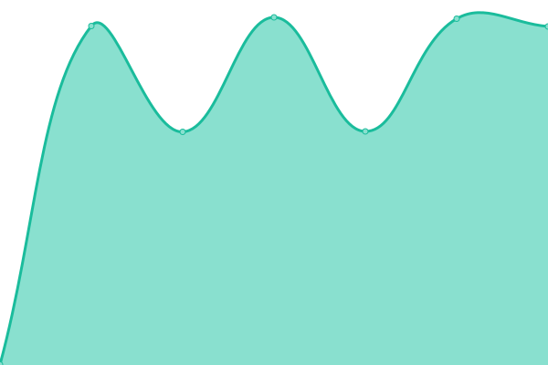
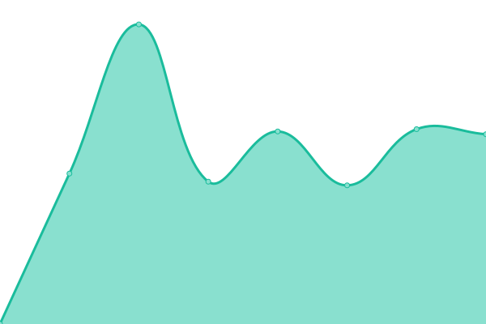
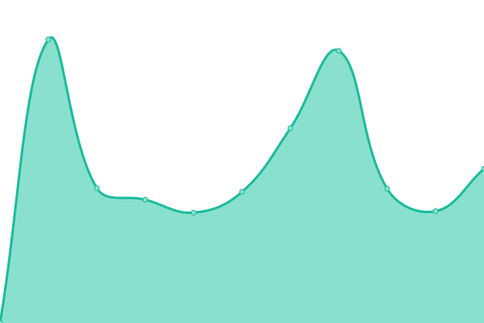

# 📈 Status: <!--live status--> **🟧 Partial outage**

Monitoramento em **tempo real** dos sites mantidos por Tomazzoni • Hospedagem de site e emails. Pode ser visto em [status.tomazzoni.net](https://status.tomazzoni.net)

<!--start: status pages-->
<!-- This summary is generated by Upptime (https://github.com/upptime/upptime) -->
<!-- Do not edit this manually, your changes will be overwritten -->
<!-- prettier-ignore -->
| URL | Status | History | Response Time | Uptime |
| --- | ------ | ------- | ------------- | ------ |
|  [construtoralcs.com.br](https://construtoralcs.com.br) | 🟩 Up | [construtoralcs-com-br.yml](https://github.com/tomattone/status/commits/HEAD/history/construtoralcs-com-br.yml) | 

 6140ms
     
 | 

<a href="https://status.tomazzoni.net/history/construtoralcs-com-br">100.00%</a>
    

|  [construtoralcs.com.br](https://construtoralcs.com.br) | 🟩 Up | [construtoralcs-com-br.yml](https://github.com/tomattone/status/commits/HEAD/history/construtoralcs-com-br.yml) | 

 6140ms
     
 | 

<a href="https://status.tomazzoni.net/history/construtoralcs-com-br">100.00%</a>
    

|  [mudardeimovel.com.br](https://mudardeimovel.com.br) | 🟩 Up | [mudardeimovel-com-br.yml](https://github.com/tomattone/status/commits/HEAD/history/mudardeimovel-com-br.yml) | 

 606ms
     
 | 

<a href="https://status.tomazzoni.net/history/mudardeimovel-com-br">100.00%</a>
    

|  [lafontebr.com](https://lafontebr.com) | 🟩 Up | [lafontebr-com.yml](https://github.com/tomattone/status/commits/HEAD/history/lafontebr-com.yml) | 

 391ms
     
 | 

<a href="https://status.tomazzoni.net/history/lafontebr-com">100.00%</a>
    

|  [basesolida.com.br](https://basesolida.com.br) | 🟩 Up | [basesolida-com-br.yml](https://github.com/tomattone/status/commits/HEAD/history/basesolida-com-br.yml) | 

 1892ms
     
 | 

<a href="https://status.tomazzoni.net/history/basesolida-com-br">100.00%</a>
    

|  [dominiovisual.com.br](https://dominiovisual.com.br) | 🟩 Up | [dominiovisual-com-br.yml](https://github.com/tomattone/status/commits/HEAD/history/dominiovisual-com-br.yml) | 

 1269ms
     
 | 

<a href="https://status.tomazzoni.net/history/dominiovisual-com-br">100.00%</a>
    

|  [polomadeireiro.com.br](https://polomadeireiro.com.br) | 🟩 Up | [polomadeireiro-com-br.yml](https://github.com/tomattone/status/commits/HEAD/history/polomadeireiro-com-br.yml) | 

 1785ms
     
 | 

<a href="https://status.tomazzoni.net/history/polomadeireiro-com-br">100.00%</a>
    

|  [vilanovamazon.com.br](https://vilanovamazon.com.br) | 🟩 Up | [vilanovamazon-com-br.yml](https://github.com/tomattone/status/commits/HEAD/history/vilanovamazon-com-br.yml) | 

 585ms
     
 | 

<a href="https://status.tomazzoni.net/history/vilanovamazon-com-br">100.00%</a>
    

|  [villenamoveis.com.br](https://villenamoveis.com.br) | 🟩 Up | [villenamoveis-com-br.yml](https://github.com/tomattone/status/commits/HEAD/history/villenamoveis-com-br.yml) | 

 1310ms
     
 | 

<a href="https://status.tomazzoni.net/history/villenamoveis-com-br">100.00%</a>
    

|  [plenacertificados.com.br](https://plenacertificados.com.br) | 🟩 Up | [plenacertificados-com-br.yml](https://github.com/tomattone/status/commits/HEAD/history/plenacertificados-com-br.yml) | 

 2395ms
     
 | 

<a href="https://status.tomazzoni.net/history/plenacertificados-com-br">100.00%</a>
    

|  [a1sistemas.com.br](https://a1sistemas.com.br) | 🟩 Up | [a1sistemas-com-br.yml](https://github.com/tomattone/status/commits/HEAD/history/a1sistemas-com-br.yml) | 

 1141ms
     
 | 

<a href="https://status.tomazzoni.net/history/a1sistemas-com-br">100.00%</a>
    

|  [aguadeanjo.com.br](https://aguadeanjo.com.br) | 🟩 Up | [aguadeanjo-com-br.yml](https://github.com/tomattone/status/commits/HEAD/history/aguadeanjo-com-br.yml) | 

 1636ms
     
 | 

<a href="https://status.tomazzoni.net/history/aguadeanjo-com-br">100.00%</a>
    

|  [brigatapizzaria.com.br](https://brigatapizzaria.com.br) | 🟩 Up | [brigatapizzaria-com-br.yml](https://github.com/tomattone/status/commits/HEAD/history/brigatapizzaria-com-br.yml) | 

 413ms
     
 | 

<a href="https://status.tomazzoni.net/history/brigatapizzaria-com-br">100.00%</a>
    

|  [calponta.com.br](https://calponta.com.br) | 🟩 Up | [calponta-com-br.yml](https://github.com/tomattone/status/commits/HEAD/history/calponta-com-br.yml) | 

 683ms
     
 | 

<a href="https://status.tomazzoni.net/history/calponta-com-br">100.00%</a>
    

|  [dnaframing.com.br](https://dnaframing.com.br) | 🟩 Up | [dnaframing-com-br.yml](https://github.com/tomattone/status/commits/HEAD/history/dnaframing-com-br.yml) | 

 1447ms
     
 | 

<a href="https://status.tomazzoni.net/history/dnaframing-com-br">100.00%</a>
    

|  [draanelise.com.br](https://draanelise.com.br) | 🟩 Up | [draanelise-com-br.yml](https://github.com/tomattone/status/commits/HEAD/history/draanelise-com-br.yml) | 

 478ms
     
 | 

<a href="https://status.tomazzoni.net/history/draanelise-com-br">100.00%</a>
    

|  [estofadosabara.com.br](https://estofadosabara.com.br) | 🟩 Up | [estofadosabara-com-br.yml](https://github.com/tomattone/status/commits/HEAD/history/estofadosabara-com-br.yml) | 

 3547ms
     
 | 

<a href="https://status.tomazzoni.net/history/estofadosabara-com-br">100.00%</a>
    

|  [fraciona.com.br](https://fraciona.com.br) | 🟩 Up | [fraciona-com-br.yml](https://github.com/tomattone/status/commits/HEAD/history/fraciona-com-br.yml) | 

 1451ms
     
 | 

<a href="https://status.tomazzoni.net/history/fraciona-com-br">100.00%</a>
    

|  [grupoprocess.com.br](https://grupoprocess.com.br) | 🟩 Up | [grupoprocess-com-br.yml](https://github.com/tomattone/status/commits/HEAD/history/grupoprocess-com-br.yml) | 

 658ms
     
 | 

<a href="https://status.tomazzoni.net/history/grupoprocess-com-br">100.00%</a>
    

|  [jato.eco.br](https://jato.eco.br) | 🟩 Up | [jato-eco-br.yml](https://github.com/tomattone/status/commits/HEAD/history/jato-eco-br.yml) | 

 14282ms
     
 | 

<a href="https://status.tomazzoni.net/history/jato-eco-br">100.00%</a>
    

|  [kaosestudio.com.br](https://kaosestudio.com.br) | 🟩 Up | [kaosestudio-com-br.yml](https://github.com/tomattone/status/commits/HEAD/history/kaosestudio-com-br.yml) | 

 688ms
     
 | 

<a href="https://status.tomazzoni.net/history/kaosestudio-com-br">49.49%</a>
    

|  [marinazanettiarq.com.br](https://marinazanettiarq.com.br) | 🟩 Up | [marinazanettiarq-com-br.yml](https://github.com/tomattone/status/commits/HEAD/history/marinazanettiarq-com-br.yml) | 

 498ms
     
 | 

<a href="https://status.tomazzoni.net/history/marinazanettiarq-com-br">100.00%</a>
    

|  [maybmaia.com.br](https://maybmaia.com.br) | 🟩 Up | [maybmaia-com-br.yml](https://github.com/tomattone/status/commits/HEAD/history/maybmaia-com-br.yml) | 

 1355ms
     
 | 

<a href="https://status.tomazzoni.net/history/maybmaia-com-br">100.00%</a>
    

|  [odontofares.com.br](https://odontofares.com.br) | 🟩 Up | [odontofares-com-br.yml](https://github.com/tomattone/status/commits/HEAD/history/odontofares-com-br.yml) | 

 515ms
     
 | 

<a href="https://status.tomazzoni.net/history/odontofares-com-br">100.00%</a>
    

|  [oficinadorocha.com.br](https://oficinadorocha.com.br) | 🟩 Up | [oficinadorocha-com-br.yml](https://github.com/tomattone/status/commits/HEAD/history/oficinadorocha-com-br.yml) | 

 507ms
     
 | 

<a href="https://status.tomazzoni.net/history/oficinadorocha-com-br">100.00%</a>
    

|  [reydolacteo.com.br](https://reydolacteo.com.br) | 🟥 Down | [reydolacteo-com-br.yml](https://github.com/tomattone/status/commits/HEAD/history/reydolacteo-com-br.yml) | 

 0ms
     
 | 

<a href="https://status.tomazzoni.net/history/reydolacteo-com-br">0.00%</a>
    

|  [rhodmann.com.br](https://rhodmann.com.br) | 🟩 Up | [rhodmann-com-br.yml](https://github.com/tomattone/status/commits/HEAD/history/rhodmann-com-br.yml) | 

 7277ms
     
 | 

<a href="https://status.tomazzoni.net/history/rhodmann-com-br">100.00%</a>
    

|  [riobrancolab.com.br](https://riobrancolab.com.br) | 🟩 Up | [riobrancolab-com-br.yml](https://github.com/tomattone/status/commits/HEAD/history/riobrancolab-com-br.yml) | 

 1290ms
     
 | 

    

|  [romanceshistoricos.com.br](https://romanceshistoricos.com.br) | 🟩 Up | [romanceshistoricos-com-br.yml](https://github.com/tomattone/status/commits/HEAD/history/romanceshistoricos-com-br.yml) | 

 2281ms
     
 | 

<a href="https://status.tomazzoni.net/history/romanceshistoricos-com-br">100.00%</a>
    

|  [s4cursosetreinamentos.com.br](https://s4cursosetreinamentos.com.br) | 🟥 Down | [s4cursosetreinamentos-com-br.yml](https://github.com/tomattone/status/commits/HEAD/history/s4cursosetreinamentos-com-br.yml) | 

 0ms
     
 | 

<a href="https://status.tomazzoni.net/history/s4cursosetreinamentos-com-br">43.67%</a>
    

|  [studio32.com.br](https://studio32.com.br) | 🟩 Up | [studio32-com-br.yml](https://github.com/tomattone/status/commits/HEAD/history/studio32-com-br.yml) | 

 705ms
     
 | 

<a href="https://status.tomazzoni.net/history/studio32-com-br">43.68%</a>
    

|  [cachoeiradamariquinha.com.br](https://cachoeiradamariquinha.com.br) | 🟩 Up | [cachoeiradamariquinha-com-br.yml](https://github.com/tomattone/status/commits/HEAD/history/cachoeiradamariquinha-com-br.yml) | 

 18179ms
     
 | 

<a href="https://status.tomazzoni.net/history/cachoeiradamariquinha-com-br">100.00%</a>
    

|  [edmararaujo.com.br](https://edmararaujo.com.br) | 🟩 Up | [edmararaujo-com-br.yml](https://github.com/tomattone/status/commits/HEAD/history/edmararaujo-com-br.yml) | 

 1056ms
     
 | 

<a href="https://status.tomazzoni.net/history/edmararaujo-com-br">100.00%</a>
    

|  [funerariasantanapg.com.br](https://funerariasantanapg.com.br) | 🟩 Up | [funerariasantanapg-com-br.yml](https://github.com/tomattone/status/commits/HEAD/history/funerariasantanapg-com-br.yml) | 

 2402ms
     
 | 

<a href="https://status.tomazzoni.net/history/funerariasantanapg-com-br">100.00%</a>
    

|  [tokencertificadora.com.br](https://tokencertificadora.com.br) | 🟩 Up | [tokencertificadora-com-br.yml](https://github.com/tomattone/status/commits/HEAD/history/tokencertificadora-com-br.yml) | 

 907ms
     
 | 

<a href="https://status.tomazzoni.net/history/tokencertificadora-com-br">100.00%</a>
    

|  [jank.adv.br](https://jank.adv.br) | 🟩 Up | [jank-adv-br.yml](https://github.com/tomattone/status/commits/HEAD/history/jank-adv-br.yml) | 

 4146ms
     
 | 

<a href="https://status.tomazzoni.net/history/jank-adv-br">100.00%</a>
    

|  [arfuturocert.com.br](https://arfuturocert.com.br) | 🟥 Down | [arfuturocert-com-br.yml](https://github.com/tomattone/status/commits/HEAD/history/arfuturocert-com-br.yml) | 

 0ms
     
 | 

<a href="https://status.tomazzoni.net/history/arfuturocert-com-br">43.71%</a>
    

|  [alolventures.com.br](https://alolventures.com.br) | 🟩 Up | [alolventures-com-br.yml](https://github.com/tomattone/status/commits/HEAD/history/alolventures-com-br.yml) | 

 686ms
     
 | 

<a href="https://status.tomazzoni.net/history/alolventures-com-br">100.00%</a>
    

|  [pontaengenharia.com.br](https://pontaengenharia.com.br) | 🟩 Up | [pontaengenharia-com-br.yml](https://github.com/tomattone/status/commits/HEAD/history/pontaengenharia-com-br.yml) | 

 260ms
     
 | 

<a href="https://status.tomazzoni.net/history/pontaengenharia-com-br">100.00%</a>
    

|  [vitallelaboratorio.com.br](https://vitallelaboratorio.com.br) | 🟩 Up | [vitallelaboratorio-com-br.yml](https://github.com/tomattone/status/commits/HEAD/history/vitallelaboratorio-com-br.yml) | 

 307ms
     
 | 

<a href="https://status.tomazzoni.net/history/vitallelaboratorio-com-br">100.00%</a>
    

|  [atendimento.vitallelaboratorio.com.br](https://atendimento.vitallelaboratorio.com.br) | 🟩 Up | [atendimento-vitallelaboratorio-com-br.yml](https://github.com/tomattone/status/commits/HEAD/history/atendimento-vitallelaboratorio-com-br.yml) | 

 641ms
     
 | 

<a href="https://status.tomazzoni.net/history/atendimento-vitallelaboratorio-com-br">100.00%</a>
    

|  [culturasulfm.com.br](https://culturasulfm.com.br) | 🟩 Up | [culturasulfm-com-br.yml](https://github.com/tomattone/status/commits/HEAD/history/culturasulfm-com-br.yml) | 

 5242ms
     
 | 

<a href="https://status.tomazzoni.net/history/culturasulfm-com-br">100.00%</a>
    

|  [cormixtintas.com.br](https://cormixtintas.com.br) | 🟩 Up | [cormixtintas-com-br.yml](https://github.com/tomattone/status/commits/HEAD/history/cormixtintas-com-br.yml) | 

 669ms
     
 | 

<a href="https://status.tomazzoni.net/history/cormixtintas-com-br">43.72%</a>
    

|  [lojasulfashion.com.br](https://lojasulfashion.com.br) | 🟩 Up | [lojasulfashion-com-br.yml](https://github.com/tomattone/status/commits/HEAD/history/lojasulfashion-com-br.yml) | 

 14786ms
     
 | 

<a href="https://status.tomazzoni.net/history/lojasulfashion-com-br">100.00%</a>
    

|  [villagioverdeeventos.com.br](https://villagioverdeeventos.com.br) | 🟩 Up | [villagioverdeeventos-com-br.yml](https://github.com/tomattone/status/commits/HEAD/history/villagioverdeeventos-com-br.yml) | 

 14614ms
     
 | 

<a href="https://status.tomazzoni.net/history/villagioverdeeventos-com-br">100.00%</a>
    

|  [fluidponta.com.br](https://fluidponta.com.br) | 🟩 Up | [fluidponta-com-br.yml](https://github.com/tomattone/status/commits/HEAD/history/fluidponta-com-br.yml) | 

 606ms
     
 | 

<a href="https://status.tomazzoni.net/history/fluidponta-com-br">100.00%</a>
    

|  [lojaodokeima.com.br](https://lojaodokeima.com.br) | 🟩 Up | [lojaodokeima-com-br.yml](https://github.com/tomattone/status/commits/HEAD/history/lojaodokeima-com-br.yml) | 

 858ms
     
 | 

<a href="https://status.tomazzoni.net/history/lojaodokeima-com-br">100.00%</a>
    

|  [retibom.com](https://retibom.com) | 🟩 Up | [retibom-com.yml](https://github.com/tomattone/status/commits/HEAD/history/retibom-com.yml) | 

 7984ms
     
 | 

<a href="https://status.tomazzoni.net/history/retibom-com">100.00%</a>
    

|  [trcdistribuicao.com.br](https://trcdistribuicao.com.br) | 🟥 Down | [trcdistribuicao-com-br.yml](https://github.com/tomattone/status/commits/HEAD/history/trcdistribuicao-com-br.yml) | 

 206ms
     
 | 

<a href="https://status.tomazzoni.net/history/trcdistribuicao-com-br">43.76%</a>
    

|  [servtintas.com.br](https://servtintas.com.br) | 🟩 Up | [servtintas-com-br.yml](https://github.com/tomattone/status/commits/HEAD/history/servtintas-com-br.yml) | 

 589ms
     
 | 

<a href="https://status.tomazzoni.net/history/servtintas-com-br">100.00%</a>
    

|  [miarakruger.com.br](https://miarakruger.com.br) | 🟩 Up | [miarakruger-com-br.yml](https://github.com/tomattone/status/commits/HEAD/history/miarakruger-com-br.yml) | 

 738ms
     
 | 

<a href="https://status.tomazzoni.net/history/miarakruger-com-br">100.00%</a>
    

|  [aldeia.work](https://aldeia.work) | 🟩 Up | [aldeia-work.yml](https://github.com/tomattone/status/commits/HEAD/history/aldeia-work.yml) | 

 658ms
     
 | 

<a href="https://status.tomazzoni.net/history/aldeia-work">100.00%</a>
    

|  [capitalli.co](https://capitalli.co) | 🟥 Down | [capitalli-co.yml](https://github.com/tomattone/status/commits/HEAD/history/capitalli-co.yml) | 

 0ms
     
 | 

<a href="https://status.tomazzoni.net/history/capitalli-co">43.83%</a>
    

|  [tecplastbrasil.com.br](https://tecplastbrasil.com.br) | 🟩 Up | [tecplastbrasil-com-br.yml](https://github.com/tomattone/status/commits/HEAD/history/tecplastbrasil-com-br.yml) | 

 598ms
     
 | 

<a href="https://status.tomazzoni.net/history/tecplastbrasil-com-br">100.00%</a>
    

|  [brickto.com](https://brickto.com) | 🟩 Up | [brickto-com.yml](https://github.com/tomattone/status/commits/HEAD/history/brickto-com.yml) | 

 1847ms
     
 | 

<a href="https://status.tomazzoni.net/history/brickto-com">100.00%</a>
    

|  [grupoefisco.com.br](https://grupoefisco.com.br) | 🟩 Up | [grupoefisco-com-br.yml](https://github.com/tomattone/status/commits/HEAD/history/grupoefisco-com-br.yml) | 

 1025ms
     
 | 

<a href="https://status.tomazzoni.net/history/grupoefisco-com-br">100.00%</a>
    

|  [homebankbrasil.com.br](https://homebankbrasil.com.br) | 🟩 Up | [homebankbrasil-com-br.yml](https://github.com/tomattone/status/commits/HEAD/history/homebankbrasil-com-br.yml) | 

 388ms
     
 | 

<a href="https://status.tomazzoni.net/history/homebankbrasil-com-br">100.00%</a>
    

|  [inteccontabilidade.com.br](https://inteccontabilidade.com.br) | 🟩 Up | [inteccontabilidade-com-br.yml](https://github.com/tomattone/status/commits/HEAD/history/inteccontabilidade-com-br.yml) | 

 596ms
     
 | 

<a href="https://status.tomazzoni.net/history/inteccontabilidade-com-br">100.00%</a>
    

|  [personapublicidade.com.br](https://personapublicidade.com.br) | 🟩 Up | [personapublicidade-com-br.yml](https://github.com/tomattone/status/commits/HEAD/history/personapublicidade-com-br.yml) | 

 14592ms
     
 | 

<a href="https://status.tomazzoni.net/history/personapublicidade-com-br">100.00%</a>
    

|  [traxt.io](https://traxt.io) | 🟩 Up | [traxt-io.yml](https://github.com/tomattone/status/commits/HEAD/history/traxt-io.yml) | 

 365ms
     
 | 

<a href="https://status.tomazzoni.net/history/traxt-io">100.00%</a>
    

|  [dev.stelladiamonds.com.br](https://dev.stelladiamonds.com.br) | 🟩 Up | [dev-stelladiamonds-com-br.yml](https://github.com/tomattone/status/commits/HEAD/history/dev-stelladiamonds-com-br.yml) | 

 1141ms
     
 | 

<a href="https://status.tomazzoni.net/history/dev-stelladiamonds-com-br">100.00%</a>
    

|  [prazeresdobanhoabc.com.br](https://prazeresdobanhoabc.com.br) | 🟩 Up | [prazeresdobanhoabc-com-br.yml](https://github.com/tomattone/status/commits/HEAD/history/prazeresdobanhoabc-com-br.yml) | 

 1490ms
     
 | 

<a href="https://status.tomazzoni.net/history/prazeresdobanhoabc-com-br">100.00%</a>
    

|  [mirocozinhaevinho.com.br](https://mirocozinhaevinho.com.br) | 🟩 Up | [mirocozinhaevinho-com-br.yml](https://github.com/tomattone/status/commits/HEAD/history/mirocozinhaevinho-com-br.yml) | 

 3112ms
     
 | 

<a href="https://status.tomazzoni.net/history/mirocozinhaevinho-com-br">100.00%</a>
    

|  [estudiohugofreire.com](https://estudiohugofreire.com) | 🟩 Up | [estudiohugofreire-com.yml](https://github.com/tomattone/status/commits/HEAD/history/estudiohugofreire-com.yml) | 

 509ms
     
 | 

<a href="https://status.tomazzoni.net/history/estudiohugofreire-com">100.00%</a>
    

|  [coopesp.com.br](https://coopesp.com.br) | 🟩 Up | [coopesp-com-br.yml](https://github.com/tomattone/status/commits/HEAD/history/coopesp-com-br.yml) | 

 3835ms
     
 | 

<a href="https://status.tomazzoni.net/history/coopesp-com-br">100.00%</a>
    

|  [conceitoimoveispg.com.br](https://conceitoimoveispg.com.br) | 🟩 Up | [conceitoimoveispg-com-br.yml](https://github.com/tomattone/status/commits/HEAD/history/conceitoimoveispg-com-br.yml) | 

 1860ms
     
 | 

<a href="https://status.tomazzoni.net/history/conceitoimoveispg-com-br">100.00%</a>
    

|  [construtorabaseforte.com.br](https://construtorabaseforte.com.br) | 🟩 Up | [construtorabaseforte-com-br.yml](https://github.com/tomattone/status/commits/HEAD/history/construtorabaseforte-com-br.yml) | 

 295ms
     
 | 

<a href="https://status.tomazzoni.net/history/construtorabaseforte-com-br">100.00%</a>
    

|  [solarini.com.br](https://solarini.com.br) | 🟩 Up | [solarini-com-br.yml](https://github.com/tomattone/status/commits/HEAD/history/solarini-com-br.yml) | 

 1566ms
     
 | 

<a href="https://status.tomazzoni.net/history/solarini-com-br">100.00%</a>
    

|  [ecbeng.com.br](https://ecbeng.com.br) | 🟩 Up | [ecbeng-com-br.yml](https://github.com/tomattone/status/commits/HEAD/history/ecbeng-com-br.yml) | 

 1289ms
     
 | 

<a href="https://status.tomazzoni.net/history/ecbeng-com-br">100.00%</a>
    

|  [macpontacaminhoes.com.br](https://macpontacaminhoes.com.br) | 🟩 Up | [macpontacaminhoes-com-br.yml](https://github.com/tomattone/status/commits/HEAD/history/macpontacaminhoes-com-br.yml) | 

 4472ms
     
 | 

<a href="https://status.tomazzoni.net/history/macpontacaminhoes-com-br">100.00%</a>
    

|  [opiummotel.com](https://opiummotel.com) | 🟩 Up | [opiummotel-com.yml](https://github.com/tomattone/status/commits/HEAD/history/opiummotel-com.yml) | 

 970ms
     
 | 

<a href="https://status.tomazzoni.net/history/opiummotel-com">100.00%</a>
    

|  [consipa.com.br](https://consipa.com.br) | 🟩 Up | [consipa-com-br.yml](https://github.com/tomattone/status/commits/HEAD/history/consipa-com-br.yml) | 

 446ms
     
 | 

<a href="https://status.tomazzoni.net/history/consipa-com-br">100.00%</a>
    

|  [lepiegemotel.com.br](https://lepiegemotel.com.br) | 🟩 Up | [lepiegemotel-com-br.yml](https://github.com/tomattone/status/commits/HEAD/history/lepiegemotel-com-br.yml) | 

 1100ms
     
 | 

<a href="https://status.tomazzoni.net/history/lepiegemotel-com-br">100.00%</a>
    

|  [lojacentermodas.com](https://lojacentermodas.com) | 🟩 Up | [lojacentermodas-com.yml](https://github.com/tomattone/status/commits/HEAD/history/lojacentermodas-com.yml) | 

 840ms
     
 | 

<a href="https://status.tomazzoni.net/history/lojacentermodas-com">43.88%</a>
    

|  [miquelao.com.br](https://miquelao.com.br) | 🟩 Up | [miquelao-com-br.yml](https://github.com/tomattone/status/commits/HEAD/history/miquelao-com-br.yml) | 

 213ms
     
 | 

<a href="https://status.tomazzoni.net/history/miquelao-com-br">100.00%</a>
    

|  [mush.eco](https://mush.eco) | 🟩 Up | [mush-eco.yml](https://github.com/tomattone/status/commits/HEAD/history/mush-eco.yml) | 

 1128ms
     
 | 

<a href="https://status.tomazzoni.net/history/mush-eco">100.00%</a>
    

|  [vilavilo.com.br](https://vilavilo.com.br) | 🟩 Up | [vilavilo-com-br.yml](https://github.com/tomattone/status/commits/HEAD/history/vilavilo-com-br.yml) | 

 512ms
     
 | 

<a href="https://status.tomazzoni.net/history/vilavilo-com-br">100.00%</a>
    

|  [visonmotel.com](https://visonmotel.com) | 🟩 Up | [visonmotel-com.yml](https://github.com/tomattone/status/commits/HEAD/history/visonmotel-com.yml) | 

 1084ms
     
 | 

<a href="https://status.tomazzoni.net/history/visonmotel-com">100.00%</a>
    

|  [analise.eng.br](https://analise.eng.br) | 🟩 Up | [analise-eng-br.yml](https://github.com/tomattone/status/commits/HEAD/history/analise-eng-br.yml) | 

 306ms
     
 | 

<a href="https://status.tomazzoni.net/history/analise-eng-br">100.00%</a>
    

|  [andressavieira.com.br](https://andressavieira.com.br) | 🟩 Up | [andressavieira-com-br.yml](https://github.com/tomattone/status/commits/HEAD/history/andressavieira-com-br.yml) | 

 17487ms
     
 | 

<a href="https://status.tomazzoni.net/history/andressavieira-com-br">100.00%</a>
    

|  [cdepg.org.br](https://cdepg.org.br) | 🟩 Up | [cdepg-org-br.yml](https://github.com/tomattone/status/commits/HEAD/history/cdepg-org-br.yml) | 

 7792ms
     
 | 

<a href="https://status.tomazzoni.net/history/cdepg-org-br">100.00%</a>
    

|  [centralpremy.com.br](https://centralpremy.com.br) | 🟩 Up | [centralpremy-com-br.yml](https://github.com/tomattone/status/commits/HEAD/history/centralpremy-com-br.yml) | 

 313ms
     
 | 

<a href="https://status.tomazzoni.net/history/centralpremy-com-br">100.00%</a>
    

|  [compensadosgranada.com.br](https://compensadosgranada.com.br) | 🟩 Up | [compensadosgranada-com-br.yml](https://github.com/tomattone/status/commits/HEAD/history/compensadosgranada-com-br.yml) | 

 5726ms
     
 | 

<a href="https://status.tomazzoni.net/history/compensadosgranada-com-br">100.00%</a>
    

|  [construtoralegacy.com.br](https://construtoralegacy.com.br) | 🟩 Up | [construtoralegacy-com-br.yml](https://github.com/tomattone/status/commits/HEAD/history/construtoralegacy-com-br.yml) | 

 746ms
     
 | 

<a href="https://status.tomazzoni.net/history/construtoralegacy-com-br">100.00%</a>
    

|  [contornoturbo.com.br](https://contornoturbo.com.br) | 🟩 Up | [contornoturbo-com-br.yml](https://github.com/tomattone/status/commits/HEAD/history/contornoturbo-com-br.yml) | 

 2205ms
     
 | 

<a href="https://status.tomazzoni.net/history/contornoturbo-com-br">100.00%</a>
    

|  [delpozotransportes.com.br](https://delpozotransportes.com.br) | 🟩 Up | [delpozotransportes-com-br.yml](https://github.com/tomattone/status/commits/HEAD/history/delpozotransportes-com-br.yml) | 

 4827ms
     
 | 

<a href="https://status.tomazzoni.net/history/delpozotransportes-com-br">100.00%</a>
    

|  [gabrielambrozio.com](https://gabrielambrozio.com) | 🟩 Up | [gabrielambrozio-com.yml](https://github.com/tomattone/status/commits/HEAD/history/gabrielambrozio-com.yml) | 

 891ms
     
 | 

<a href="https://status.tomazzoni.net/history/gabrielambrozio-com">100.00%</a>
    

|  [globotc.com.br](https://globotc.com.br) | 🟩 Up | [globotc-com-br.yml](https://github.com/tomattone/status/commits/HEAD/history/globotc-com-br.yml) | 

 1837ms
     
 | 

<a href="https://status.tomazzoni.net/history/globotc-com-br">100.00%</a>
    

|  [ibras.com.br](https://ibras.com.br) | 🟩 Up | [ibras-com-br.yml](https://github.com/tomattone/status/commits/HEAD/history/ibras-com-br.yml) | 

 639ms
     
 | 

<a href="https://status.tomazzoni.net/history/ibras-com-br">100.00%</a>
    

|  [krugerflorestal.com.br](https://krugerflorestal.com.br) | 🟩 Up | [krugerflorestal-com-br.yml](https://github.com/tomattone/status/commits/HEAD/history/krugerflorestal-com-br.yml) | 

 2086ms
     
 | 

<a href="https://status.tomazzoni.net/history/krugerflorestal-com-br">100.00%</a>
    

|  [medicoapp.com.br](https://medicoapp.com.br) | 🟥 Down | [medicoapp-com-br.yml](https://github.com/tomattone/status/commits/HEAD/history/medicoapp-com-br.yml) | 

 0ms
     
 | 

<a href="https://status.tomazzoni.net/history/medicoapp-com-br">0.00%</a>
    

|  [melhorapartamento.com.br](https://melhorapartamento.com.br) | 🟩 Up | [melhorapartamento-com-br.yml](https://github.com/tomattone/status/commits/HEAD/history/melhorapartamento-com-br.yml) | 

 427ms
     
 | 

<a href="https://status.tomazzoni.net/history/melhorapartamento-com-br">100.00%</a>
    

|  [melkland.com.br](https://melkland.com.br) | 🟩 Up | [melkland-com-br.yml](https://github.com/tomattone/status/commits/HEAD/history/melkland-com-br.yml) | 

 442ms
     
 | 

<a href="https://status.tomazzoni.net/history/melkland-com-br">100.00%</a>
    

|  [mkclinic.com.br](https://mkclinic.com.br) | 🟩 Up | [mkclinic-com-br.yml](https://github.com/tomattone/status/commits/HEAD/history/mkclinic-com-br.yml) | 

 229ms
     
 | 

<a href="https://status.tomazzoni.net/history/mkclinic-com-br">100.00%</a>
    

|  [mmmilleo.com.br](https://mmmilleo.com.br) | 🟩 Up | [mmmilleo-com-br.yml](https://github.com/tomattone/status/commits/HEAD/history/mmmilleo-com-br.yml) | 

 441ms
     
 | 

<a href="https://status.tomazzoni.net/history/mmmilleo-com-br">100.00%</a>
    

|  [na4.com.br](https://na4.com.br) | 🟩 Up | [na4-com-br.yml](https://github.com/tomattone/status/commits/HEAD/history/na4-com-br.yml) | 

 727ms
     
 | 

<a href="https://status.tomazzoni.net/history/na4-com-br">100.00%</a>
    

|  [nascarautovidros.com.br](https://nascarautovidros.com.br) | 🟩 Up | [nascarautovidros-com-br.yml](https://github.com/tomattone/status/commits/HEAD/history/nascarautovidros-com-br.yml) | 

 435ms
     
 | 

<a href="https://status.tomazzoni.net/history/nascarautovidros-com-br">100.00%</a>
    

|  [pollipinus.com.br](https://pollipinus.com.br) | 🟩 Up | [pollipinus-com-br.yml](https://github.com/tomattone/status/commits/HEAD/history/pollipinus-com-br.yml) | 

 519ms
     
 | 

<a href="https://status.tomazzoni.net/history/pollipinus-com-br">100.00%</a>
    

|  [pramio.com.br](https://pramio.com.br) | 🟥 Down | [pramio-com-br.yml](https://github.com/tomattone/status/commits/HEAD/history/pramio-com-br.yml) | 

 193ms
     
 | 

<a href="https://status.tomazzoni.net/history/pramio-com-br">43.97%</a>
    

|  [prmempreendimentos.com.br](https://prmempreendimentos.com.br) | 🟩 Up | [prmempreendimentos-com-br.yml](https://github.com/tomattone/status/commits/HEAD/history/prmempreendimentos-com-br.yml) | 

 416ms
     
 | 

<a href="https://status.tomazzoni.net/history/prmempreendimentos-com-br">100.00%</a>
    

|  [rbsodontologia.com.br](https://rbsodontologia.com.br) | 🟥 Down | [rbsodontologia-com-br.yml](https://github.com/tomattone/status/commits/HEAD/history/rbsodontologia-com-br.yml) | 

 0ms
     
 | 

<a href="https://status.tomazzoni.net/history/rbsodontologia-com-br">0.00%</a>
    

|  [rotarypontagrossa.com.br](https://rotarypontagrossa.com.br) | 🟥 Down | [rotarypontagrossa-com-br.yml](https://github.com/tomattone/status/commits/HEAD/history/rotarypontagrossa-com-br.yml) | 

 0ms
     
 | 

<a href="https://status.tomazzoni.net/history/rotarypontagrossa-com-br">0.00%</a>
    

|  [saltte.com.br](https://saltte.com.br) | 🟥 Down | [saltte-com-br.yml](https://github.com/tomattone/status/commits/HEAD/history/saltte-com-br.yml) | 

 0ms
     
 | 

<a href="https://status.tomazzoni.net/history/saltte-com-br">43.97%</a>
    

|  [construtorajmc.com.br](https://construtorajmc.com.br) | 🟩 Up | [construtorajmc-com-br.yml](https://github.com/tomattone/status/commits/HEAD/history/construtorajmc-com-br.yml) | 

 440ms
     
 | 

<a href="https://status.tomazzoni.net/history/construtorajmc-com-br">100.00%</a>
    

|  [2coelhos.com.br](https://2coelhos.com.br) | 🟩 Up | [2coelhos-com-br.yml](https://github.com/tomattone/status/commits/HEAD/history/2coelhos-com-br.yml) | 

 4826ms
     
 | 

<a href="https://status.tomazzoni.net/history/2coelhos-com-br">100.00%</a>
    

|  [absolutacertificados.com.br](https://absolutacertificados.com.br) | 🟩 Up | [absolutacertificados-com-br.yml](https://github.com/tomattone/status/commits/HEAD/history/absolutacertificados-com-br.yml) | 

 478ms
     
 | 

<a href="https://status.tomazzoni.net/history/absolutacertificados-com-br">100.00%</a>
    

|  [agilpressseguros.com.br](https://agilpressseguros.com.br) | 🟩 Up | [agilpressseguros-com-br.yml](https://github.com/tomattone/status/commits/HEAD/history/agilpressseguros-com-br.yml) | 

 468ms
     
 | 

<a href="https://status.tomazzoni.net/history/agilpressseguros-com-br">100.00%</a>
    

|  [agpmarcasepatentes.com.br](https://agpmarcasepatentes.com.br) | 🟩 Up | [agpmarcasepatentes-com-br.yml](https://github.com/tomattone/status/commits/HEAD/history/agpmarcasepatentes-com-br.yml) | 

 1165ms
     
 | 

<a href="https://status.tomazzoni.net/history/agpmarcasepatentes-com-br">100.00%</a>
    

|  [alluv.com.br](https://alluv.com.br) | 🟩 Up | [alluv-com-br.yml](https://github.com/tomattone/status/commits/HEAD/history/alluv-com-br.yml) | 

 2349ms
     
 | 

<a href="https://status.tomazzoni.net/history/alluv-com-br">100.00%</a>
    

|  [assodaf.com.br](https://assodaf.com.br) | 🟩 Up | [assodaf-com-br.yml](https://github.com/tomattone/status/commits/HEAD/history/assodaf-com-br.yml) | 

 1251ms
     
 | 

<a href="https://status.tomazzoni.net/history/assodaf-com-br">100.00%</a>
    

|  [lordtower.com.br](https://lordtower.com.br) | 🟩 Up | [lordtower-com-br.yml](https://github.com/tomattone/status/commits/HEAD/history/lordtower-com-br.yml) | 

 673ms
     
 | 

<a href="https://status.tomazzoni.net/history/lordtower-com-br">100.00%</a>
    

|  [terraseguros.com.br](https://terraseguros.com.br) | 🟩 Up | [terraseguros-com-br.yml](https://github.com/tomattone/status/commits/HEAD/history/terraseguros-com-br.yml) | 

 217ms
     
 | 

<a href="https://status.tomazzoni.net/history/terraseguros-com-br">100.00%</a>
    

|  [farmaervadoce.com.br](https://farmaervadoce.com.br) | 🟩 Up | [farmaervadoce-com-br.yml](https://github.com/tomattone/status/commits/HEAD/history/farmaervadoce-com-br.yml) | 

 1948ms
     
 | 

<a href="https://status.tomazzoni.net/history/farmaervadoce-com-br">100.00%</a>
    

|  [conceitoimoveissc.com.br](https://conceitoimoveissc.com.br) | 🟩 Up | [conceitoimoveissc-com-br.yml](https://github.com/tomattone/status/commits/HEAD/history/conceitoimoveissc-com-br.yml) | 

 1845ms
     
 | 

<a href="https://status.tomazzoni.net/history/conceitoimoveissc-com-br">100.00%</a>
    

|  [julianamacielarqinteriores.com.br](https://julianamacielarqinteriores.com.br) | 🟩 Up | [julianamacielarqinteriores-com-br.yml](https://github.com/tomattone/status/commits/HEAD/history/julianamacielarqinteriores-com-br.yml) | 

 1185ms
     
 | 

<a href="https://status.tomazzoni.net/history/julianamacielarqinteriores-com-br">100.00%</a>
    

|  [mercadodeeventos.com](https://www.mercadodeeventos.com) | 🟩 Up | [mercadodeeventos-com.yml](https://github.com/tomattone/status/commits/HEAD/history/mercadodeeventos-com.yml) | 

 600ms
     
 | 

<a href="https://status.tomazzoni.net/history/mercadodeeventos-com">50.27%</a>
    

|  [vfteng.com.br](https://vfteng.com.br) | 🟩 Up | [vfteng-com-br.yml](https://github.com/tomattone/status/commits/HEAD/history/vfteng-com-br.yml) | 

 898ms
     
 | 

<a href="https://status.tomazzoni.net/history/vfteng-com-br">100.00%</a>
    

|  [avanttengenharia.com.br](https://avanttengenharia.com.br) | 🟥 Down | [avanttengenharia-com-br.yml](https://github.com/tomattone/status/commits/HEAD/history/avanttengenharia-com-br.yml) | 

 0ms
     
 | 

<a href="https://status.tomazzoni.net/history/avanttengenharia-com-br">44.01%</a>
    

|  [conceitoimoveisbc.com.br](https://conceitoimoveisbc.com.br) | 🟩 Up | [conceitoimoveisbc-com-br.yml](https://github.com/tomattone/status/commits/HEAD/history/conceitoimoveisbc-com-br.yml) | 

 960ms
     
 | 

<a href="https://status.tomazzoni.net/history/conceitoimoveisbc-com-br">100.00%</a>
    

|  [orquestraapreciatto.com.br](https://orquestraapreciatto.com.br) | 🟩 Up | [orquestraapreciatto-com-br.yml](https://github.com/tomattone/status/commits/HEAD/history/orquestraapreciatto-com-br.yml) | 

 1564ms
     
 | 

<a href="https://status.tomazzoni.net/history/orquestraapreciatto-com-br">100.00%</a>
    

|  [rodrigoscheidt.com](https://rodrigoscheidt.com) | 🟩 Up | [rodrigoscheidt-com.yml](https://github.com/tomattone/status/commits/HEAD/history/rodrigoscheidt-com.yml) | 

 1026ms
     
 | 

<a href="https://status.tomazzoni.net/history/rodrigoscheidt-com">100.00%</a>
    

|  [feijaopontarollo.com.br](https://feijaopontarollo.com.br) | 🟩 Up | [feijaopontarollo-com-br.yml](https://github.com/tomattone/status/commits/HEAD/history/feijaopontarollo-com-br.yml) | 

 2509ms
     
 | 

<a href="https://status.tomazzoni.net/history/feijaopontarollo-com-br">100.00%</a>
    

|  [omxsistemas.com.br](https://omxsistemas.com.br) | 🟩 Up | [omxsistemas-com-br.yml](https://github.com/tomattone/status/commits/HEAD/history/omxsistemas-com-br.yml) | 

 8410ms
     
 | 

<a href="https://status.tomazzoni.net/history/omxsistemas-com-br">100.00%</a>
    

|  [torrie.com.br](https://torrie.com.br) | 🟩 Up | [torrie-com-br.yml](https://github.com/tomattone/status/commits/HEAD/history/torrie-com-br.yml) | 

 2107ms
     
 | 

<a href="https://status.tomazzoni.net/history/torrie-com-br">100.00%</a>
    

|  [lionsdev.com.br](https://lionsdev.com.br) | 🟩 Up | [lionsdev-com-br.yml](https://github.com/tomattone/status/commits/HEAD/history/lionsdev-com-br.yml) | 

 2226ms
     
 | 

<a href="https://status.tomazzoni.net/history/lionsdev-com-br">100.00%</a>
    

|  [preambulo.com.br](https://preambulo.com.br) | 🟩 Up | [preambulo-com-br.yml](https://github.com/tomattone/status/commits/HEAD/history/preambulo-com-br.yml) | 

 267ms
     
 | 

<a href="https://status.tomazzoni.net/history/preambulo-com-br">100.00%</a>
    

|  [m3hengenharia.com](https://m3hengenharia.com) | 🟩 Up | [m3hengenharia-com.yml](https://github.com/tomattone/status/commits/HEAD/history/m3hengenharia-com.yml) | 

 251ms
     
 | 

<a href="https://status.tomazzoni.net/history/m3hengenharia-com">100.00%</a>
    

|  [aguiasistemas.com.br](https://aguiasistemas.com.br) | 🟩 Up | [aguiasistemas-com-br.yml](https://github.com/tomattone/status/commits/HEAD/history/aguiasistemas-com-br.yml) | 

 1770ms
     
 | 

<a href="https://status.tomazzoni.net/history/aguiasistemas-com-br">100.00%</a>
    

|  [compensadosscharan.com.br](https://compensadosscharan.com.br) | 🟩 Up | [compensadosscharan-com-br.yml](https://github.com/tomattone/status/commits/HEAD/history/compensadosscharan-com-br.yml) | 

 460ms
     
 | 

<a href="https://status.tomazzoni.net/history/compensadosscharan-com-br">100.00%</a>
    

|  [shoppingcarpg.com.br](https://shoppingcarpg.com.br) | 🟩 Up | [shoppingcarpg-com-br.yml](https://github.com/tomattone/status/commits/HEAD/history/shoppingcarpg-com-br.yml) | 

 465ms
     
 | 

<a href="https://status.tomazzoni.net/history/shoppingcarpg-com-br">100.00%</a>
    

|  [agrobiologica.com.br](https://agrobiologica.com.br) | 🟩 Up | [agrobiologica-com-br.yml](https://github.com/tomattone/status/commits/HEAD/history/agrobiologica-com-br.yml) | 

 4717ms
     
 | 

<a href="https://status.tomazzoni.net/history/agrobiologica-com-br">100.00%</a>
    

|  [sosalegria.org](https://sosalegria.org) | 🟩 Up | [sosalegria-org.yml](https://github.com/tomattone/status/commits/HEAD/history/sosalegria-org.yml) | 

 3791ms
     
 | 

<a href="https://status.tomazzoni.net/history/sosalegria-org">100.00%</a>
    

|  [tomazzoni.net](https://tomazzoni.net) | 🟩 Up | [tomazzoni-net.yml](https://github.com/tomattone/status/commits/HEAD/history/tomazzoni-net.yml) | 

 649ms
     
 | 

<a href="https://status.tomazzoni.net/history/tomazzoni-net">100.00%</a>
    

|  [agenciarazza.com.br](https://agenciarazza.com.br) | 🟩 Up | [agenciarazza-com-br.yml](https://github.com/tomattone/status/commits/HEAD/history/agenciarazza-com-br.yml) | 

 561ms
     
 | 

<a href="https://status.tomazzoni.net/history/agenciarazza-com-br">100.00%</a>
    

<!--end: status pages-->

[**Visit pelo site →**](https://status.tomazzoni.net)
